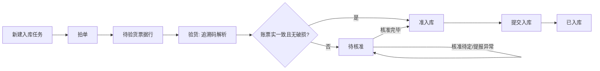

# 掌店易智能入库 PC PRD

## 0. 文档信息

| 项目 | 内容 |
| --- | --- |
| 功能名称 | 掌店易智能入库 PC 工作台 |
| 文档版本 | v1.0 |
| 状态 | 当前 Demo 对齐稿；生产实现需补全接口、权限和持久化 |
| 适用端 | 医药 O2O 前置仓店员桌面端浏览器 |
| 首屏 | 入库任务列表 |
| 核心流程 | 任务入口 -> 拍单 -> 验货 -> 核准 -> 入库 |
| 更新时间 | 2026-07-11 |
| 交互唯一规格 | [工作流与状态](workflow-and-states.md) |

本文档区分两种事实：**当前 Demo** 指已在前端实现的行为；**生产规则** 指上线时应由服务端、权限和审计共同保证的规则。页面布局与动画优先服从当前交互规格和 [PC UI 规范](../design/pc-ui-spec.md)。

页面级操作细节不在本文重复维护，分别见 [拍单页](pages/photo.md)、[验货页](pages/inspection.md)、[核准页](pages/approval.md)；视觉参数见 [PC UI 规范](../design/pc-ui-spec.md)。

## 1. 背景与目标

到货入库需要把系统采购单、随货同行单和实物追溯码核对一致。传统流程需要店员先找单、逐行翻票、扫码、核批次，信息分散且异常处理延后。

目标：

1. 用“入库任务”承载一次供应商到货，支持查看历史任务与创建任务。
2. 将操作收敛为拍单、验货、核准三步，系统不要求店员先找采购单。
3. 在 PC 横向工作台中同时呈现扫描/队列/证据/状态，减少页面跳转。
4. 将一致明细沉淀为准入库，将异常集中到核准，最终形成可追溯的入库结果。

非目标：移动端适配、设备边框模拟、独立找单页、生产级 OCR/相机/追溯服务的真实接入。

## 2. 用户、实体与状态

### 2.1 用户

| 角色 | 目标 | 核心操作 |
| --- | --- | --- |
| 前置仓店员 | 快速完成到货入库 | 新建/进入任务、拍单、扫码验货、处理异常、提交入库 |
| 店长/运营 | 复核异常和结果 | 查看任务、核准明细、已入库快照与异常记录 |

### 2.2 核心实体

| 实体 | 关键字段 | 说明 |
| --- | --- | --- |
| InboundTask | id、supplier、status、step、receiptCount、traceCount、abnormalCount、updatedAt | 一次到货入库的根实体。 |
| ReceiptPhoto | id、taskId、imageUrl、title、createdAt | 一张随货同行单。 |
| ReceiptLine | id、photoId、lineNo、name、spec、qty、batch、expiry、cropImageUrl | OCR 票据行。 |
| TraceCode | code、photoId、name、spec、approval、batch、expiry、scannedAt | 单个实物追溯码。 |
| PhysicalBatch | id、receiptId、identityKey、name、spec、approval、batch、expiry、codes、damaged、unmatched | 验货工作台的一行品批；必须保留票据归属。 |
| PurchaseOrder / PurchaseLine | id、supplier、status、lines | 系统采购单与商品行。 |
| ApprovalLine | id、physicalBatchId、purchaseLineId、receiptLineId、issue、decision、evidenceSnapshot | 核准工作台与审计的最小明细。 |
| InboundSubmission | id、taskId、lineIds、status、submittedAt、result | 准入库提交记录。 |

### 2.3 状态机

最终状态优先级：已入库 > 待核准 > 准入库 > 待验货。破损和人工提报异常强制进入待核准；本期所有有效验货明细均有码上放心资料兜底。验货页颜色映射为：已入库蓝色、待核准黄色、准入库绿色。

## 3. 页面与交互需求

### 3.1 任务入口

| 区域 | 当前 Demo 行为 | 生产规则 |
| --- | --- | --- |
| 历史任务 | 显示任务编号、供应商、步骤、票据数、追溯码数、异常数和更新时间 | 分页、筛选、权限按任务状态补充。 |
| 新建任务 | 创建默认“待拍单”的任务并进入拍单 | 服务端生成 id 并记录创建人、仓、供应商。 |
| 进入任务 | 根据任务状态恢复到对应步骤 | 恢复票据、扫码、核准决策与进度。 |
| 返回任务列表 | 回写当前任务实时统计 | 持久化后再回到列表。 |

首屏必须是任务入口，而不是营销页或三步工作台。

### 3.2 全局工作台

- 步骤条横向展示“返回任务列表、拍单、验货、核准”。
- 无票据进入验货/核准时提示先拍单；无扫码进入核准时提示先完成验货。
- 三个页面共同使用右侧 Figma 入库进度组件；点击任何状态卡打开页内明细，不能弹出遮挡式大弹窗。
- 主工作区优先占据视觉面积，禁止设备边框、移动端纵向堆叠、底部横向四状态条和解释性长文案。

### 3.3 拍单

| 要求 | 当前 Demo |
| --- | --- |
| 主区域 | 随货同行单高拍仪取景画面，包含拍照与上传入口。 |
| 票据列表 | 取景框右侧显示“已拍票据：n张”和单列纵向滚动的票据照片；每行一张。 |
| 新增票据 | 拍照/上传新增票据，待验货真实数量增加时触发进度组件动效。 |
| 管理 | 支持逐张勾选、全选/取消全选和删除所选；缩略图不提供单张删除 X。生产版需对删除影响的 OCR/核准结果二次确认。 |
| 流转 | 有票据后允许进入验货。 |

### 3.4 验货

| 要求 | 当前 Demo |
| --- | --- |
| 主布局 | 左侧扫码取景，中部可滚动品批列表，右侧进度组件。 |
| 品批聚合 | 按“票据归属 + 商品批次”聚合；多票据可产生多组同名品批。 |
| 模拟识别 | 一次可录入多个码，后续轮次轮流归属不同已拍票据。 |
| 命中排序 | 本轮最后命中品批冲到顶部，其余行平滑下移。 |
| 状态 | 一致显示“无需核准”；数据异常或破损显示“待核准”。 |
| 管理 | 支持关键词搜索、逐卡勾选、全选/取消全选当前结果、删除所选品批、查看/删除单个追溯码、破损待采退。 |

生产规则：追溯码解析、去重、批次归属和重复码判断应由后端幂等接口保证。删除最后一个码后，必须重新计算品批与票据的待验货关系。

### 3.5 核准

| 区域 | 要求 |
| --- | --- |
| 左列 | 待核准队列、数量、搜索、商品切换与当前项的绿勾/黄问号决策图标。 |
| 中部上行 | 入库信息、供应商、追溯码/批次、随货单局部命中和美团商品资料/图片。 |
| 中部下行 | 三方数据对比：实物、采购单、随货单；异常字段优先，可展开全部字段。 |
| 右列 | Figma 入库进度组件。 |
| 命令 | 队列绿勾放入准入库、黄问号留在待核准、替换采购单/随货单候选、编辑追溯码/批次、提报异常、提交入库。 |

进入核准页先显示“正在智能匹配系统单据”。点击队列绿勾时当前项飞入右侧绿色落点，进入准入库并切换下一项；点击黄问号时飞入黄色落点，保留待核准但移出当前处理队列。美团图片最多展示六张并可横向滑动；三方一致字段以灰色显示。

### 3.6 入库进度组件

视觉以 Figma `线上铺货` node `134:2688` 为准：

| 项目 | 参数 |
| --- | --- |
| 卡片顺序 | 已入库、准入库、待核准、待验货，自上而下。 |
| 卡片尺寸 | 四张卡统一为 `152 x 200px`。 |
| 卡片间隙 | `13px`。 |
| 轨道 / 内轨 | `50px / 40px`。 |
| 段比例 | 动态计算：`对应卡片数量 / 四卡数量总和`；有色段之和恒为 `100%`。 |
| 交互 | 点击卡片或轨道打开对应状态明细；详情数据按真实任务计算。 |

新建任务四张卡均为 `0`，轨道为空槽。待验货按尚无实物关联的 OCR 行计数，其余三卡按可独立核准商品卡计数；状态真实变化时轨道比例同步重算，增加的一段发光。

## 4. 动效与反馈

| 触发 | 反馈 | 时长/约束 |
| --- | --- | --- |
| 新增票据 | 票据缩略图出现；待验货卡弹动和轨道充能 | 仅真实数量增加。 |
| 模拟/真实识别 | 扫描成功浮层；命中品批冲顶；旧行平滑下移 | 卡片高亮约 2 秒，码高亮约 1 秒。 |
| 待核准/待验货增加 | 目标卡 `bucket-impact`，轨道高光向右推进 | 卡片约 0.92 秒，轨道约 0.64 秒。 |
| 准入库/已入库增加 | 目标卡 `bucket-impact`，轨道从左侧推进 | 同上。 |
| 动效清理 | 移除 `charging`、`bucket-impact`、`batch-rush-top` | 轨道/卡约 1.05 秒，命中行约 2 秒。 |

切换步骤、打开历史任务或普通重渲染不得触发进度发光。

## 5. 业务规则与边界

| 编号 | 场景 | 规则 |
| --- | --- | --- |
| BR-001 | 无票据进验货/核准 | 拦截并提示先拍摄或上传随货同行单。 |
| BR-002 | 无扫码进核准 | 拦截并回到验货。 |
| BR-003 | 同批次新码 | 追加码、去重、置顶，不新建重复品批。 |
| BR-004 | 多票据 | 同批次在不同票据归属下可分别形成品批。 |
| BR-005 | 码上放心资料兜底 | 本期所有有效验货明细均能定位码上放心资料；不创建“没有找到商品信息”品批或待核准行。 |
| BR-006 | 标记破损 | 强制待核准；取消后重算。 |
| BR-007 | 删除最后一个码 | 移除品批，重算待验货和核准结果。 |
| BR-008 | 核准待定 | 保留待核准清单，移出当前队列。 |
| BR-009 | 提交入库 | 仅提交准入库页勾选明细；确认后复核系统行有效性，有效项按实录数量和最终批次生成草稿并入库，无效项重新对码核准，最后返回 A/B/C。 |
| BR-010 | 已入库明细 | 生产版只读；撤回/冲销需要独立流程。 |
| BR-011 | 重复识别已入库追溯码 | 写入前拦截，提示“无法录入已入库追溯码”；不得命中卡片、重排列表或改变进度。 |

## 6. 接口与依赖

| 能力 | 生产化依赖 | 失败策略 |
| --- | --- | --- |
| 高拍仪/OCR | 图片上传、OCR 任务、票据行和局部图 | 保留原图，标记处理失败，允许重试/补录。 |
| 追溯码 | 码解析、激活/关联信息、批号和效期 | 保留原始码，进入待核准，允许重试。 |
| 采购单 | 按供应商、商品、批次查询候选 | 无可靠候选进入待核准。 |
| 匹配引擎 | 输出采购单候选、票据候选、异常字段和置信度 | 不自动准入库，保留人工核准入口。 |
| 入库服务 | 批量提交、幂等、结果回写 | 部分失败须返回明细级原因，成功行不可重复提交。 |

码上放心接口的原始资料见 [码上放心接口参考](../reference/ma-shang-fang-xin-api.md)；该文件不定义本 PRD 的 UI 或业务优先级。

## 7. 审计与权限

- 任务创建、票据新增/删除、追溯码识别/删除、破损标记、候选替换、编辑批次、核准决策和提交入库均需记录操作人、时间、前后值和任务/明细 id。
- 店员可创建任务、拍单、验货和处理其权限范围内的核准；主管/运营的核准、编辑和撤回权限需在生产方案确认。
- 图片、OCR、追溯码和核准快照的保存周期由合规规则决定，当前 Demo 不做持久化。

## 8. 验收标准

| 编号 | Given | When | Then |
| --- | --- | --- |
| AC-001 | 首次进入 | 页面加载 | 展示入库任务列表与新建任务入口。 |
| AC-002 | 新建任务 | 点击新建 | 进入拍单，任务为待拍单。 |
| AC-003 | 已拍票据 | 查看拍单页 | 票据在取景框右侧的单列中展示，每行一张。 |
| AC-004 | 无票据 | 点击验货或核准 | 出现先拍单提示，不切入后续工作台。 |
| AC-005 | 已拍票据 | 点击验货 | 展示左右并置的扫码画面与品批列表。 |
| AC-006 | 多张票据、多次识别 | 查看品批列表 | 行数随结果增长，允许不同票据形成独立品批。 |
| AC-007 | 识别命中 | 点击模拟识别 | 命中行在顶部，已有行平滑下移，命中和码高亮按时结束。 |
| AC-008 | 异常/一致识别 | 状态真实增加 | 仅对应进度卡和轨道播放动效。 |
| AC-009 | 进入核准 | 匹配完成 | 队列、详情、商品资料、三方对比和右侧进度组件保持三列 PC 布局。 |
| AC-010 | 查看核准详情 | 查看上行与下行 | 美团商品位于上行右侧，三方数据对比独占下行。 |
| AC-011 | 点击任一进度卡 | 打开状态 | 进入页内明细，不弹出遮挡主工作区的大弹窗。 |
| AC-012 | 动效结束 | 等待清理窗口 | 不残留 `charging`、`bucket-impact` 或 `batch-rush-top` 类。 |
| AC-013 | 待核准明细未匹配系统单 | 单条或批量提交准入库 | 提示“未匹配系统单据，无法入库”，状态不变化。 |
| AC-014 | 准入库已勾选明细 | 点击提交并继续 | 只提交勾选项，生成入库草稿并显示 A/B/C 回执。 |
| AC-015 | 已入库明细 | 打开核准详情 | 详情严格只读，只提供返回。 |

## 9. 待生产确认

1. 自动匹配阈值和供应商/金额/近效期异常是否阻断入库。
2. OCR 失败是否允许手工补录及其审核路径。
3. 编辑追溯码、编辑批次和核准完毕是否需要主管权限。
4. 勾选入库中部分系统行失效时，是有效项继续还是整批回滚；B 是否包含失败项，A/C 是否按系统行去重。
5. 已入库后的撤回/冲销、审计和库存联动机制。
