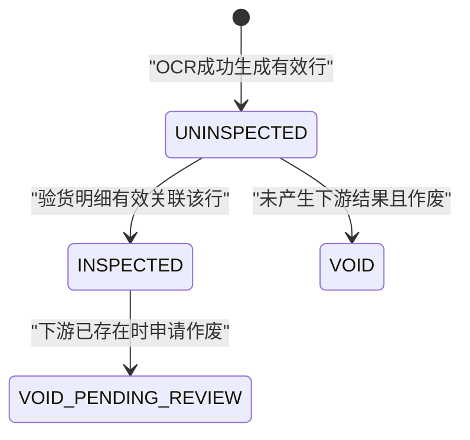
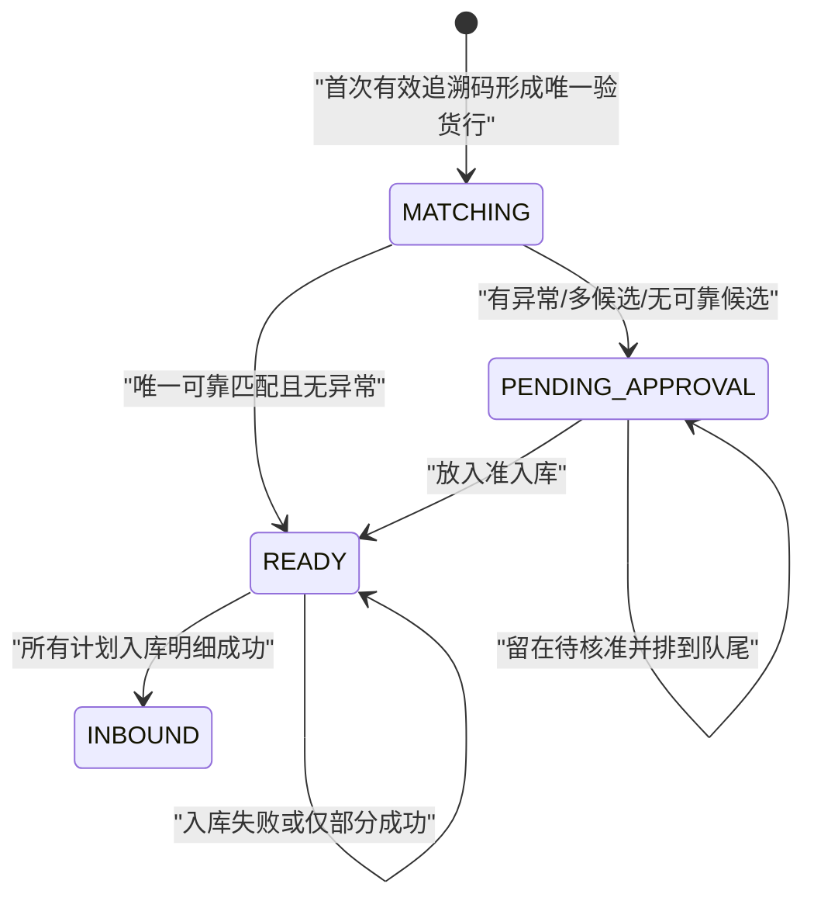

# 入库提效三期｜主数据、业务实体与表关系

## 0. 文档定位

| 项目 | 内容 |
| --- | --- |
| 文档目标 | 为“拍单—验货—核准—入库”建立统一的数据底座，作为后续页面需求、接口设计、状态规则和验收口径的共同依据 |
| 文档类型 | 产品可读的领域数据模型；不是可直接执行的数据库 DDL |
| 当前状态 | V1.0 讨论稿；已确认业务规则已落表，少数边界见“待共研” |
| 更新时间 | 2026-07-13 |
| 业务基线 | 用户 2026-07-13 导出的《入库提效三期 拍单入库》3.1 实体关系、3.2 主数据及后续确认 |
| 关联需求 | [AI 版需求文档](入库提效三期-拍单入库-AI版需求文档.md) |

本文采用“高级架构约束 + 产品语言”双层表达：先说明一个对象在业务上代表什么，再给出建议表、关键字段、唯一性和关系。字段类型只表达必要的数据形态，研发可结合现有技术栈确定最终数据库类型。

### 0.1 后续需求的强制引用规则

今后新增页面、按钮、状态、筛选或算法时，必须先回答以下问题，再描述 UI：

1. 操作的是哪个业务实体，聚合根是谁？
2. 记录的唯一性由什么保证？
3. 页面字段来自哪张表、哪个字段，还是由哪些数据聚合？
4. 操作会造成什么状态迁移，是否改变四卡数量？
5. 是否需要历史快照、操作审计和最近操作时间？
6. 失败、重复、并发和逆向时如何保证原数据不丢失？

如果上述问题没有答案，该需求只能标为“待共研”，不能只写一个页面表现后直接开发。

---

## 1. 建模结论

### 1.1 一句话模型

**入库任务是会话聚合根；随货单 OCR 行提供“票”，码上放心验货明细提供“实”，掌店易采购明细提供“账”；匹配候选连接三者，核准动作确定当前选择，入库提交把已选择的验货明细写入实际采购明细。**

### 1.2 最重要的八条原则

1. **任务不是包裹或采购单。** 一个任务允许关联多个包裹、供应商、码上放心单据和采购单。
2. **三个粒度不能混用。** OCR 行、码上放心验货行、采购明细分别对应待验货、待核准/准入库、已入库。
3. **追溯码必须逐码保存。** 不把追溯码数组只塞在任务或验货明细的大字段里，否则无法去重、追责和部分处理。
4. **外部数据要留快照。** 码上放心和采购单数据会变化，核准与入库必须能还原当时看到的证据。
5. **候选与最终选择分开。** 算法给出的候选、人工最终选择和入库结果是三个不同事实，不能互相覆盖。
6. **当前状态与历史事件分开。** 主表保存当前可用状态，审计表追加保存每次变化。
7. **四卡数量是投影，不是独立真相。** 数字由明细表按各自唯一粒度聚合；任务摘要表只用于列表查询加速。
8. **业务删除优先作废。** 一旦产生下游匹配、核准或入库记录，不物理删除原图、OCR 行、追溯码或验货明细。

### 1.3 当前三张主表的架构性调整

| 当前需求写法 | 保留内容 | 推荐调整 | 原因 |
| --- | --- | --- | --- |
| 入库任务主表 | 任务 id、门店 id | 增加任务状态、当前步骤、时间、版本；“找不到码上放心的码序列”拆到逐码表 | 避免数组字段不可检索、不可去重、不可审计 |
| 验货明细表 | 已确认业务唯一键和实物字段 | 保留聚合结果；应录码来自上游码表，实录码来自任务追溯码表 | 数量可校验，逐码可追溯 |
| 随货单明细表 | 图片/行序号、坐标、OCR 商品字段 | 增加随货单头、图片和 OCR 任务层；行只承载行级字段 | 支持多图、重试、成功/失败角标和 OCR 版本 |

---

## 2. 数据分层与归属

### 2.1 四类数据

| 层级 | 作用 | 典型对象 | 是否由本模块负责修改 |
| --- | --- | --- | --- |
| 企业主数据 | 全公司共享且有独立权威来源 | 门店、员工、供应商、商品 | 否，只引用 id 并保留必要快照 |
| 外部/上游单据 | “账”和上游“实”的权威来源 | 掌店易采购单、采购明细、码上放心单据与明细 | 采购单只引用；码上放心查询结果本地留快照 |
| 入库业务数据 | 本模块的核心事实 | 入库任务、随货单、OCR 行、追溯码、验货明细、匹配、核准、入库提交 | 是 |
| 查询投影 | 为任务首页和四卡快速展示 | 任务摘要、四卡数量、搜索聚合文本 | 可重建，不是业务真源 |

### 2.2 外部主数据引用

这些对象不建议在本模块重复建设主表，但所有业务表应保存稳定 id，并在核准/入库快照中保存必要展示值。

| 外部对象 | 稳定引用 | 本模块使用场景 | 必要快照 |
| --- | --- | --- | --- |
| 门店/仓 | `store_id` | 任务归属、采购单过滤、权限 | 门店名称可在任务创建时快照 |
| 操作人 | `operator_id` | 创建、拍单、扫码、核准、入库、审计 | 操作人名称可在事件中快照 |
| 供应商 | `supplier_id` / 码上放心 `entid` | 任务筛选、候选匹配、核准 | 供应商名称、外部企业 id |
| 商品 | `goods_id` / `drug_ent_base_info_id` | 商品匹配、美团资料、结果查看 | 名称、规格、准字、厂家 |
| 掌店易采购单 | `purchase_order_id` | 系统单候选与入库目标 | 单号、状态、供应商、查询时版本 |
| 掌店易采购明细 | `purchase_order_line_id` | 最终入库落点 | 商品、数量、已入库量、剩余量、批次信息 |
| 美团商品资料 | `meituan_goods_id` 或现有映射 id | 核准辅助信息与最多六张图片 | 核准时只需证据快照，不参与入库主键 |

### 2.3 共享主数据与系统单字段契约

以下是本模块依赖的逻辑字段契约。若现有中台/ERP 已有对应表，应直接复用或通过接口读取，不再创建同名权威表；若缺失外部映射能力，再由主数据域统一补建。

#### M01 `supplier_external_mapping`｜供应商外部映射

| 字段 | 必要性 | 业务规则 |
| --- | --- | --- |
| `supplier_mapping_id` | 必须 | 映射记录主键 |
| `supplier_id` | 必须 | 掌店易供应商 id |
| `external_platform` | 必须 | `MXFX`、其他平台 |
| `external_supplier_id` | 必须 | 码上放心 `entid/from_user_id` 等稳定企业 id |
| `supplier_name_snapshot` | 必须 | 建立映射时的外部名称 |
| `mapping_status` | 必须 | `ACTIVE`、`PENDING_REVIEW`、`INVALID` |
| `mapping_source` | 必须 | 人工绑定、历史沉淀、系统推荐 |
| `effective_from/to` | 建议 | 映射有效期 |

**唯一性：** `external_platform + external_supplier_id` 只能指向一个当前生效供应商；名称相似只能产生推荐，不能创建强映射。

#### M02 `goods_external_mapping`｜商品外部映射

| 字段 | 必要性 | 业务规则 |
| --- | --- | --- |
| `goods_mapping_id` | 必须 | 映射主键 |
| `goods_id` | 必须 | 掌店易商品 id |
| `external_platform` | 必须 | `MXFX`、`MEITUAN` 等 |
| `external_goods_id` | 必须 | 码上放心 `drug_ent_base_info_id` 或美团商品 id |
| `approval_no_snapshot` | 建议 | 建立映射时批准文号 |
| `mapping_status` | 必须 | `ACTIVE`、`PENDING_REVIEW`、`INVALID` |
| `mapping_source` | 必须 | 人工绑定、历史沉淀、系统推荐 |
| `confidence` | 建议 | 推荐映射置信度；不替代人工生效状态 |

**唯一性：** 同一平台外部商品 id 只能有一个当前生效映射；若业务允许一品多规，唯一性需带上规格维度并由商品主数据域确认。

#### E01 `purchase_order`｜掌店易采购单逻辑实体

| 字段 | 必要性 | 本模块用途 |
| --- | --- | --- |
| `purchase_order_id` | 必须 | 采购单稳定主键 |
| `purchase_order_no` | 必须 | 列表展示、筛选和审计 |
| `platform_order_no` | 建议 | 平台单号展示与辅助匹配 |
| `store_id` | 必须 | 候选池硬过滤，必须等于任务门店 |
| `supplier_id` | 必须 | 供应商映射和一致性判断 |
| `supplier_name` | 必须 | 展示及名称兜底 |
| `order_status` | 必须 | 只允许待收/部分入库等可收货状态进入候选 |
| `order_date` | 建议 | 候选窗口与展示 |
| `row_version/updated_at` | 必须 | 防止匹配后采购单状态已变化 |

#### E02 `purchase_order_line`｜掌店易采购明细逻辑实体

| 字段 | 必要性 | 本模块用途 |
| --- | --- | --- |
| `purchase_order_line_id` | 必须 | 采购明细稳定主键和最终入库落点 |
| `purchase_order_id` | 必须 | 所属采购单 |
| `goods_id` | 必须 | 内部商品 id |
| `goods_name/spec` | 必须 | 候选匹配与三方对比 |
| `approval_no` | 建议 | 商品强证据 |
| `manufacturer` | 建议 | 厂家核准 |
| `barcode` | 建议 | 商品辅助证据 |
| `order_qty` | 必须 | 采购数量 |
| `inbounded_qty` | 必须 | 已入库数量 |
| `remaining_qty` | 必须 | 抢单与入库的实时可用余量 |
| `product_batch_no` | 可选 | 系统已有批号时参与匹配 |
| `expiry_date` | 可选 | 系统已有效期时参与核准 |
| `amount` | 可选 | 金额提示，是否阻断待业务确认 |
| `line_status` | 必须 | 当前明细是否允许收货 |
| `row_version/updated_at` | 必须 | 软占用、锁定和提交时重新校验 |

采购明细的 `remaining_qty` 是抢单的实时基准，任何本地快照都不能替代提交时的最终校验。

---

## 3. 全局实体关系

### 3.1 业务关系总览

```mermaid
erDiagram
    INBOUND_TASK ||--|| INBOUND_TASK_SUMMARY : "生成列表投影"
    INBOUND_TASK ||--o{ TASK_SUPPLIER_REL : "关联供应商"
    INBOUND_TASK ||--o{ TASK_PURCHASE_ORDER_REL : "关联采购单"
    INBOUND_TASK ||--o{ TASK_MXFX_BILL_REL : "关联码上放心单据"

    INBOUND_TASK ||--o{ RECEIPT_DOCUMENT : "包含随货单"
    RECEIPT_DOCUMENT ||--o{ RECEIPT_IMAGE : "包含图片页"
    RECEIPT_IMAGE ||--o{ RECEIPT_OCR_JOB : "多次识别"
    RECEIPT_IMAGE ||--o{ RECEIPT_LINE : "产生有效OCR行"

    MXFX_BILL_SNAPSHOT ||--o{ MXFX_BILL_LINE_SNAPSHOT : "包含上游明细"
    MXFX_BILL_LINE_SNAPSHOT ||--o{ MXFX_EXPECTED_CODE : "包含应录码"

    INBOUND_TASK ||--o{ TASK_TRACE_CODE : "扫描实录码"
    INBOUND_TASK ||--o{ VERIFICATION_LINE : "聚合验货明细"
    VERIFICATION_LINE ||--o{ VERIFICATION_MXFX_LINE_REL : "追溯上游原始行"
    MXFX_BILL_LINE_SNAPSHOT ||--o{ VERIFICATION_MXFX_LINE_REL : "被聚合"
    VERIFICATION_LINE ||--o{ TASK_TRACE_CODE : "聚拢实录码"
    VERIFICATION_LINE ||--o{ VERIFICATION_ANOMALY : "产生字段异常"

    VERIFICATION_LINE ||--o{ MATCH_RUN : "执行匹配"
    MATCH_RUN ||--o{ SYSTEM_CANDIDATE_GROUP : "产生系统单候选组"
    SYSTEM_CANDIDATE_GROUP ||--o{ SYSTEM_CANDIDATE_ITEM : "包含1至2条采购明细"
    MATCH_RUN ||--o{ RECEIPT_CANDIDATE_GROUP : "产生随货单候选组"
    RECEIPT_CANDIDATE_GROUP ||--o{ RECEIPT_CANDIDATE_ITEM : "包含1至2条OCR行"
    RECEIPT_LINE ||--o{ RECEIPT_CANDIDATE_ITEM : "被候选组引用"

    VERIFICATION_LINE ||--o{ PURCHASE_LINE_RESERVATION : "占用采购明细余量"
    SYSTEM_CANDIDATE_GROUP ||--o{ PURCHASE_LINE_RESERVATION : "选中后形成占用"
    PURCHASE_ORDER ||--o{ PURCHASE_ORDER_LINE : "包含采购明细"
    PURCHASE_ORDER ||--o{ TASK_PURCHASE_ORDER_REL : "被任务关联"
    PURCHASE_ORDER_LINE ||--o{ SYSTEM_CANDIDATE_ITEM : "成为候选成员"
    PURCHASE_ORDER_LINE ||--o{ PURCHASE_LINE_RESERVATION : "被占用"
    VERIFICATION_LINE ||--o{ APPROVAL_ACTION : "产生核准历史"
    INBOUND_TASK ||--o{ INBOUND_SUBMISSION : "发起入库"
    INBOUND_SUBMISSION ||--o{ INBOUND_SUBMISSION_LINE : "包含入库明细"
    VERIFICATION_LINE ||--o{ INBOUND_SUBMISSION_LINE : "提交到采购明细"
    INBOUND_TASK ||--o{ TASK_EVENT : "记录业务事件"
```



### 3.2 聚合根与修改边界

| 聚合根 | 内部对象 | 允许一次事务内保证的规则 |
| --- | --- | --- |
| 入库任务 | 任务关联、当前阶段、任务摘要、任务事件 | 任务状态、最近操作时间和摘要版本一致 |
| 随货单 | 随货单头、图片、OCR 任务、OCR 行 | 一次 OCR 终态、有效行和待验货投影一致 |
| 验货明细 | 实录码关系、异常、匹配运行和候选 | 任务内码唯一、验货唯一键唯一、状态分流一致 |
| 核准记录 | 当前验货明细状态 + 追加动作记录 | 决策、队列顺序、卡片数量和审计同时成功或同时失败 |
| 入库提交 | 提交单、提交明细、外部结果 | 幂等提交、明细级成功/失败和已入库投影一致 |

---

## 4. 表目录

### 4.1 业务写模型

| 编号 | 表名 | 中文名 | 核心职责 |
| --- | --- | --- | --- |
| T01 | `inbound_task` | 入库任务 | 操作会话根实体 |
| T02 | `task_supplier_rel` | 任务—供应商关系 | 支持一任务多供应商与筛选 |
| T03 | `task_purchase_order_rel` | 任务—采购单关系 | 支持一任务多采购单与恢复 |
| T04 | `task_mxfx_bill_rel` | 任务—码上放心单据关系 | 记录任务发现过的上游单据 |
| T05 | `receipt_document` | 随货单 | 随货单业务头与多图归属 |
| T06 | `receipt_image` | 随货单图片 | 原图、顺序、角标和当前 OCR 状态 |
| T07 | `receipt_ocr_job` | OCR 识别任务 | 记录每次识别/重试 |
| T08 | `receipt_line` | 随货单 OCR 明细 | 待验货的唯一统计单元 |
| T09 | `mxfx_bill_snapshot` | 码上放心单据快照 | 保存查询时单据头证据 |
| T10 | `mxfx_bill_line_snapshot` | 码上放心明细快照 | 保存上游药品批次明细 |
| T11 | `mxfx_expected_code` | 码上放心应录码 | 保存上游应录追溯码集合 |
| T12 | `task_trace_code` | 任务追溯码 | 保存每一个首次有效扫描及异常结果 |
| T13 | `verification_line` | 验货明细 | 以确认唯一键聚合实物和当前处理状态 |
| T14 | `verification_mxfx_line_rel` | 验货—上游明细关系 | 保留聚合前原始行来源 |
| T15 | `verification_anomaly` | 验货异常 | 保存字段级差异和处理状态 |
| T16 | `match_run` | 匹配运行 | 保存一次算法输入、版本和结果 |
| T17 | `system_candidate_group` | 系统单候选组 | 表达一条或两条采购明细组合候选 |
| T18 | `system_candidate_item` | 系统单候选成员 | 候选组中的采购明细 |
| T19 | `receipt_candidate_group` | 随货单候选组 | 表达一条或两条 OCR 行组合候选 |
| T20 | `receipt_candidate_item` | 随货单候选成员 | 候选组中的 OCR 明细 |
| T21 | `purchase_line_reservation` | 采购明细占用 | 防止多个验货明细超额抢占同一采购明细 |
| T22 | `approval_action` | 核准动作 | 追加保存人工选择、待定和修正历史 |
| T23 | `inbound_submission` | 入库提交单 | 一次任务级提交请求 |
| T24 | `inbound_submission_line` | 入库提交明细 | 验货明细到采购明细的实际入库结果 |
| T25 | `task_event` | 任务业务事件 | 审计、最近操作时间和问题追溯 |

### 4.2 查询读模型

| 编号 | 表名 | 中文名 | 核心职责 |
| --- | --- | --- | --- |
| R01 | `inbound_task_summary` | 入库任务摘要 | 为任务首页、筛选和四卡提供可重建的快速查询数据 |

### 4.3 通用字段约定

除追加型历史表外，业务表默认包含：

| 字段 | 含义 |
| --- | --- |
| `created_at` / `created_by` | 创建时间与创建人 |
| `updated_at` / `updated_by` | 当前记录最后一次实际变化的时间与操作人 |
| `row_version` | 并发更新版本，防止两个终端互相覆盖 |
| `record_status` | `ACTIVE` / `VOID`；有下游结果时优先作废而非物理删除 |

追加型表只新增不覆盖，至少保留 `created_at`、`created_by` 和请求/链路标识。

---

## 5. 任务域表结构

### 5.1 T01 `inbound_task`｜入库任务

#### 业务含义

一次门店到货处理会话。它允许混合多个包裹、供应商和采购单，不代表一个具体包裹或单据。

| 字段 | 类型建议 | 必填 | 业务含义与规则 |
| --- | --- | --- | --- |
| `inbound_task_id` | ID | 是 | 主键，入库任务唯一标识 |
| `task_no` | 字符串 | 是 | 用户可见任务单号，全局唯一 |
| `store_id` | ID | 是 | 门店/仓 id |
| `creator_id` | ID | 是 | 任务创建人 |
| `task_status` | 枚举 | 是 | `PROCESSING` 处理中、`COMPLETED` 已完成、`VOID` 已作废；部分入库由明细结果表达，不强制新增任务状态 |
| `current_step` | 枚举 | 是 | `PHOTO`、`INSPECTION`、`APPROVAL`；是恢复入口，不等同业务完成度 |
| `created_at` | 时间 | 是 | 任务创建时间，创建后不变 |
| `last_operated_at` | 时间 | 是 | 最近一次成功且实际改变业务数据/处理状态的服务端时间 |
| `completed_at` | 时间 | 否 | 任务完成时间；完成触发条件待共研 |
| `completed_by` | ID | 否 | 完成人 |
| `record_status` | 枚举 | 是 | 任务作废状态 |
| `row_version` | 整数 | 是 | 并发控制 |

**唯一性：** `task_no` 全局唯一。

**不直接保存：** 找不到码上放心的码数组、四卡数量、采购单号数组、供应商数组。这些来自子表或摘要投影。

### 5.2 T02 `task_supplier_rel`｜任务—供应商关系

| 字段 | 类型建议 | 必填 | 业务含义与规则 |
| --- | --- | --- | --- |
| `relation_id` | ID | 是 | 主键 |
| `inbound_task_id` | ID | 是 | 所属任务 |
| `supplier_id` | ID | 否 | 掌店易供应商 id；未映射时可为空 |
| `mxfx_ent_id` | 字符串 | 否 | 码上放心企业 id |
| `supplier_name_snapshot` | 字符串 | 是 | 首次发现时的供应商名称 |
| `relation_source` | 枚举 | 是 | `OCR`、`MXFX`、`PURCHASE_ORDER`、`MANUAL` |
| `first_seen_at` | 时间 | 是 | 首次关联时间 |
| `last_seen_at` | 时间 | 是 | 最近被业务数据命中的时间 |

**唯一性：** 优先 `任务 + supplier_id`；无内部 id 时使用 `任务 + mxfx_ent_id`；两者都缺失时只作为待映射记录，不用名称强行合并。

### 5.3 T03 `task_purchase_order_rel`｜任务—采购单关系

| 字段 | 类型建议 | 必填 | 业务含义与规则 |
| --- | --- | --- | --- |
| `relation_id` | ID | 是 | 主键 |
| `inbound_task_id` | ID | 是 | 所属任务 |
| `purchase_order_id` | ID | 是 | 掌店易采购单 id |
| `purchase_order_no_snapshot` | 字符串 | 是 | 关联时的采购单号 |
| `supplier_id_snapshot` | ID | 否 | 采购单供应商 |
| `order_status_snapshot` | 字符串 | 否 | 关联/匹配时采购单状态 |
| `relation_status` | 枚举 | 是 | `CANDIDATE` 候选、`MATCHED` 已命中、`INBOUNDED` 已产生入库 |
| `first_seen_at` | 时间 | 是 | 首次成为候选时间 |

**唯一性：** `inbound_task_id + purchase_order_id`。

### 5.4 T04 `task_mxfx_bill_rel`｜任务—码上放心单据关系

| 字段 | 类型建议 | 必填 | 业务含义与规则 |
| --- | --- | --- | --- |
| `relation_id` | ID | 是 | 主键 |
| `inbound_task_id` | ID | 是 | 所属任务 |
| `mxfx_bill_snapshot_id` | ID | 是 | 本地保存的码上放心单据快照 |
| `bill_code_snapshot` | 字符串 | 是 | 单据号，方便查询 |
| `first_trace_code_id` | ID | 否 | 首次发现该单据的实录码 |
| `first_seen_at` | 时间 | 是 | 首次关联时间 |

**唯一性：** `inbound_task_id + mxfx_bill_snapshot_id`。

---

## 6. 随货单与 OCR 域表结构

### 6.1 T05 `receipt_document`｜随货单

#### 业务含义

一张业务随货单的逻辑单据头，可包含一张或多张图片。当前若没有多页合并能力，可默认“一张图片创建一个随货单”，但数据结构不锁死一图一单。

| 字段 | 类型建议 | 必填 | 业务含义与规则 |
| --- | --- | --- | --- |
| `receipt_document_id` | ID | 是 | 主键 |
| `inbound_task_id` | ID | 是 | 所属任务 |
| `document_seq` | 整数 | 是 | 任务内随货单顺序 |
| `supplier_name_ocr` | 字符串 | 否 | OCR 识别的供应商名称 |
| `business_bill_no_ocr` | 字符串 | 否 | OCR 识别的业务单据号 |
| `ship_date_ocr` | 日期 | 否 | OCR 识别的发货日期 |
| `header_confidence` | 小数 | 否 | 单据头整体识别置信度 |
| `document_status` | 枚举 | 是 | `PENDING_OCR`、`OCR_SUCCESS`、`OCR_PARTIAL`、`OCR_FAILED`、`VOID` |

**唯一性：** `inbound_task_id + document_seq`。业务单据号来自 OCR，不作为硬唯一键，避免识别错误导致误合并。

### 6.2 T06 `receipt_image`｜随货单图片

| 字段 | 类型建议 | 必填 | 业务含义与规则 |
| --- | --- | --- | --- |
| `receipt_image_id` | ID | 是 | 主键 |
| `receipt_document_id` | ID | 是 | 所属随货单 |
| `inbound_task_id` | ID | 是 | 冗余任务 id，便于任务内查询与权限校验 |
| `image_seq` | 整数 | 是 | 任务内图片序号；待验货唯一键的一部分 |
| `page_seq` | 整数 | 是 | 同一随货单内页序号，默认 1 |
| `image_url` | 字符串 | 是 | 原图存储地址 |
| `image_hash` | 字符串 | 是 | 内容指纹，只用于重复提示；是否硬拦截待共研 |
| `capture_source` | 枚举 | 是 | `CAMERA` 拍摄、`UPLOAD` 相册上传 |
| `ocr_status` | 枚举 | 是 | `PENDING`、`PROCESSING`、`SUCCESS`、`PARTIAL`、`FAILED` |
| `current_ocr_job_id` | ID | 否 | 当前生效的 OCR 任务 |
| `captured_at` | 时间 | 是 | 拍摄/上传完成时间 |
| `captured_by` | ID | 是 | 操作人 |
| `void_reason` | 字符串 | 否 | 作废原因 |

**唯一性：** `inbound_task_id + image_seq`；同任务可对相同 `image_hash` 做提示，但当前不自动删除或合并。

### 6.3 T07 `receipt_ocr_job`｜OCR 识别任务

| 字段 | 类型建议 | 必填 | 业务含义与规则 |
| --- | --- | --- | --- |
| `ocr_job_id` | ID | 是 | 主键 |
| `receipt_image_id` | ID | 是 | 被识别图片 |
| `attempt_no` | 整数 | 是 | 该图片第几次识别 |
| `job_status` | 枚举 | 是 | `PENDING`、`PROCESSING`、`SUCCESS`、`PARTIAL`、`FAILED` |
| `provider` | 字符串 | 否 | OCR 服务来源 |
| `model_version` | 字符串 | 否 | OCR 模型/规则版本 |
| `started_at` | 时间 | 否 | 开始时间 |
| `finished_at` | 时间 | 否 | 终态时间 |
| `failure_code` | 字符串 | 否 | 失败码 |
| `failure_message` | 字符串 | 否 | 用户可理解或研发可排查的失败信息 |
| `raw_result_ref` | 字符串 | 否 | 原始返回的安全存储引用，不建议把大报文直接塞主表 |

**唯一性：** `receipt_image_id + attempt_no`。

### 6.4 T08 `receipt_line`｜随货单 OCR 明细

#### 业务含义

OCR 从某一张图片中识别出的商品数量行，是“待验货”的唯一统计单元。

| 字段 | 类型建议 | 必填 | 业务含义与规则 |
| --- | --- | --- | --- |
| `receipt_line_id` | ID | 是 | 主键 |
| `inbound_task_id` | ID | 是 | 所属任务 |
| `receipt_document_id` | ID | 是 | 所属随货单 |
| `receipt_image_id` | ID | 是 | 所属图片 |
| `ocr_job_id` | ID | 是 | 产生该行的 OCR 任务 |
| `image_seq` | 整数 | 是 | 图片序号快照 |
| `row_seq` | 整数 | 是 | 图片内行序号；待验货唯一键的一部分 |
| `left_top_point` | 坐标 | 否 | 同行第一个单元格左上坐标 `(x,y)` |
| `left_bottom_point` | 坐标 | 否 | 同行第一个单元格左下坐标 `(x,y)` |
| `right_top_point` | 坐标 | 否 | 同行最后一个单元格右上坐标 `(x,y)` |
| `right_bottom_point` | 坐标 | 否 | 同行最后一个单元格右下坐标 `(x,y)` |
| `row_crop_url` | 字符串 | 否 | 行级局部图，供核准页证据展示 |
| `goods_code_ocr` | 字符串 | 否 | OCR 商品编码 |
| `generic_name_ocr` | 字符串 | 是 | OCR 通用名；有效商品行的最小字段之一 |
| `spec_ocr` | 字符串 | 否 | OCR 规格 |
| `approval_no_ocr` | 字符串 | 否 | OCR 批准文号 |
| `dosage_form_ocr` | 字符串 | 否 | OCR 剂型 |
| `manufacturer_ocr` | 字符串 | 否 | OCR 生产厂家 |
| `batch_no_ocr` | 字符串 | 否 | OCR 生产批号 |
| `produce_date_ocr` | 日期 | 否 | OCR 生产日期 |
| `expiry_date_ocr` | 日期 | 否 | OCR 有效期至 |
| `line_qty_ocr` | 数量 | 是 | OCR 明细数量；有效商品行的最小字段之一 |
| `unit_price_ocr` | 金额 | 否 | OCR 批次单价 |
| `line_amount_ocr` | 金额 | 否 | 行金额，如源票据可识别 |
| `ocr_confidence` | 小数 | 否 | 行整体置信度 |
| `line_status` | 枚举 | 是 | `ACTIVE`、`VOID` |
| `inspection_status` | 枚举 | 是 | `UNINSPECTED` 未验货、`INSPECTED` 已验货 |
| `inspected_at` | 时间 | 否 | 完成有效对码的时间 |

**业务唯一性：** 当前生效版本按 `inbound_task_id + image_seq + row_seq` 唯一。重做 OCR 时旧行作废，新行生效，不直接覆盖已有证据。

**待验货计数：** `line_status = ACTIVE AND inspection_status = UNINSPECTED` 的行数。

---

## 7. 码上放心快照与追溯码表结构

### 7.1 T09 `mxfx_bill_snapshot`｜码上放心单据快照

| 字段 | 类型建议 | 必填 | 业务含义与规则 |
| --- | --- | --- | --- |
| `mxfx_bill_snapshot_id` | ID | 是 | 主键 |
| `bill_code` | 字符串 | 是 | 码上放心单据号 |
| `from_user_id` | 字符串 | 否 | 供应商码上放心企业 id |
| `from_ent_name` | 字符串 | 否 | 供应商名称 |
| `to_user_id` | 字符串 | 否 | 收货企业 id |
| `bill_status` | 字符串 | 否 | 上游单据状态 |
| `bill_date` | 日期时间 | 否 | 上游单据/出库时间 |
| `source_version_hash` | 字符串 | 是 | 原始内容版本指纹 |
| `fetched_at` | 时间 | 是 | 查询并保存快照的时间 |
| `raw_payload_ref` | 字符串 | 否 | 原始报文安全引用 |

**唯一性：** `bill_code + source_version_hash` 保存历史快照；任务通过关系表指向本次采用的快照。

### 7.2 T10 `mxfx_bill_line_snapshot`｜码上放心明细快照

| 字段 | 类型建议 | 必填 | 业务含义与规则 |
| --- | --- | --- | --- |
| `mxfx_bill_line_snapshot_id` | ID | 是 | 主键 |
| `mxfx_bill_snapshot_id` | ID | 是 | 所属单据快照 |
| `source_line_no` | 字符串 | 否 | 上游可提供的明细序号 |
| `drug_ent_base_info_id` | 字符串 | 是 | 药品 id |
| `physic_name` | 字符串 | 是 | 药品名称 |
| `pkg_spec_crit` | 字符串 | 否 | 包装规格 |
| `prepn_spec` | 字符串 | 否 | 制剂规格 |
| `approval_licence_no` | 字符串 | 否 | 批准文号 |
| `produce_ent_name` | 字符串 | 否 | 生产厂家 |
| `prepn_type_desc` | 字符串 | 否 | 剂型 |
| `product_batch_no` | 字符串 | 是 | 生产批号；与需求中的 `batch_no` 统一为该领域名 |
| `expire_date` | 日期 | 否 | 有效期至 |
| `produce_date` | 日期 | 否 | 生产日期 |
| `expected_qty` | 数量 | 是 | 应录数量，对应 `min_pkg_count` |
| `line_source_hash` | 字符串 | 是 | 单行内容指纹 |

**业务键：** 上游原始行由 `单据快照 + source_line_no/line_source_hash` 唯一；验货聚合仍严格使用用户确认的 `bill_code + drug_ent_base_info_id + product_batch_no`。

### 7.3 T11 `mxfx_expected_code`｜码上放心应录码

| 字段 | 类型建议 | 必填 | 业务含义与规则 |
| --- | --- | --- | --- |
| `expected_code_id` | ID | 是 | 主键 |
| `mxfx_bill_line_snapshot_id` | ID | 是 | 所属上游明细 |
| `trace_code` | 字符串 | 是 | 应录追溯码 |
| `parent_code` | 字符串 | 否 | `code_and_parent_list` 中的父码 |
| `code_level` | 字符串 | 否 | 码层级/包装层级 |
| `source_status` | 枚举 | 是 | `ACTIVE`、`INVALID` |

**唯一性：** `mxfx_bill_line_snapshot_id + trace_code`。

### 7.4 T12 `task_trace_code`｜任务追溯码

#### 业务含义

保存当前任务中每一个首次扫描到的追溯码及其查询结果。它同时承载“实录码”和“找不到码上放心的数据”，替代任务表中的码数组。

| 字段 | 类型建议 | 必填 | 业务含义与规则 |
| --- | --- | --- | --- |
| `task_trace_code_id` | ID | 是 | 主键 |
| `inbound_task_id` | ID | 是 | 所属任务 |
| `trace_code` | 字符串 | 是 | 原始追溯码，任务内唯一 |
| `scanned_at` | 时间 | 是 | 首次有效扫描时间 |
| `scanned_by` | ID | 是 | 扫码操作人 |
| `lookup_status` | 枚举 | 是 | `FOUND`、`NO_UPSTREAM_BILL`、`MULTI_BILL`、`DETAIL_FAILED`、`DETAIL_NO_CODE`、`CODE_INVALID`、`CODE_INACTIVE`、`NO_PRODUCT_INFO` |
| `api_stage` | 枚举 | 否 | 异常发生的接口阶段，如 `52560`、`53727` 等 |
| `api_code` | 字符串 | 否 | 接口返回码 |
| `api_message` | 字符串 | 否 | 接口返回信息 |
| `mxfx_bill_line_snapshot_id` | ID | 否 | 成功定位的上游原始明细 |
| `verification_line_id` | ID | 否 | 成功聚拢到的验货明细 |
| `damage_flag` | 布尔 | 是 | 该实物是否标记破损；破损不作为入库硬阻断 |
| `damage_note` | 字符串 | 否 | 破损说明 |
| `raw_result_ref` | 字符串 | 否 | 查询证据引用 |

**唯一性：** `inbound_task_id + trace_code`。重复扫码不新增该表记录，仅追加一条“重复被拦截”的任务事件。

**找不到码上放心数量：** `lookup_status != FOUND` 的有效记录数；可在任务摘要中缓存。

---

## 8. 验货与异常域表结构

### 8.1 T13 `verification_line`｜验货明细

#### 业务含义

一条验货明细代表“码上放心某一单据、某一药品、某一批号在当前任务中的实物验货结果”，是匹配、核准和准入库的中心对象。

| 字段 | 类型建议 | 必填 | 业务含义与规则 |
| --- | --- | --- | --- |
| `verification_line_id` | ID | 是 | 主键，验货明细 id |
| `inbound_task_id` | ID | 是 | 所属入库任务 |
| `bill_code` | 字符串 | 是 | 码上放心单据号，业务唯一键之一 |
| `drug_ent_base_info_id` | 字符串 | 是 | 药品 id，业务唯一键之一 |
| `product_batch_no` | 字符串 | 是 | 批号，业务唯一键之一 |
| `supplier_mxfx_ent_id` | 字符串 | 否 | 供应商码上放心企业 id，对应 `from_user_id` |
| `supplier_name_snapshot` | 字符串 | 否 | 供应商名称，对应 `from_ent_name` |
| `physic_name_snapshot` | 字符串 | 是 | 药品名称 |
| `pkg_spec_snapshot` | 字符串 | 否 | 包装规格，对应 `pkg_spec_crit` |
| `prepn_spec_snapshot` | 字符串 | 否 | 制剂规格 |
| `approval_no_snapshot` | 字符串 | 否 | 批准文号，对应 `approval_licence_no` |
| `manufacturer_snapshot` | 字符串 | 否 | 生产厂家 |
| `dosage_form_snapshot` | 字符串 | 否 | 剂型 |
| `expiry_date_snapshot` | 日期 | 否 | 有效期至 |
| `produce_date_snapshot` | 日期 | 否 | 生产日期 |
| `expected_qty` | 数量 | 是 | 应录数量；由关联的上游明细汇总 |
| `actual_qty` | 数量 | 是 | 实录数量；由关联的有效 `task_trace_code` 计数，可在本表缓存 |
| `code_match_status` | 枚举 | 是 | `MATCHED`、`MISSING`、`EXTRA`、`UNRESOLVED` |
| `system_match_status` | 枚举 | 是 | `NOT_RUN`、`UNIQUE`、`MULTIPLE`、`NONE`、`CONFLICT` |
| `receipt_match_status` | 枚举 | 是 | `NOT_RUN`、`UNIQUE`、`MULTIPLE`、`NONE`、`LOW_CONFIDENCE`、`CONFLICT` |
| `processing_status` | 枚举 | 是 | `MATCHING`、`PENDING_APPROVAL`、`READY`、`INBOUND`、`VOID` |
| `current_match_run_id` | ID | 否 | 当前生效的匹配运行 |
| `selected_system_group_id` | ID | 否 | 当前采用的系统单候选组 |
| `selected_receipt_group_id` | ID | 否 | 当前采用的随货单候选组 |
| `queue_sort_no` | 长整数 | 否 | 待核准队列顺序；留在待核准时取新的最大值 |
| `has_damage` | 布尔 | 是 | 是否包含破损实物，由关联追溯码汇总 |
| `first_scanned_at` | 时间 | 是 | 首个有效码进入时间 |
| `last_scanned_at` | 时间 | 是 | 最近新增有效码时间 |
| `inbound_at` | 时间 | 否 | 该验货明细完成入库的时间 |

**确认的业务唯一性：** `inbound_task_id + bill_code + drug_ent_base_info_id + product_batch_no`。

> 架构说明：表内保留商品和供应商快照是为了让列表快速展示和历史可还原；其来源仍必须能通过 T14 追溯到码上放心原始快照，不能把快照当成新的企业商品主数据。

**应录/实录序列：**

- 应录码序列来自 T11 `mxfx_expected_code`；
- 实录码序列来自 T12 `task_trace_code`；
- 本表只缓存数量，不把完整码数组重复保存。

### 8.2 T14 `verification_mxfx_line_rel`｜验货—上游明细关系

#### 业务含义

用户确认的验货唯一键可能聚合到一个或多个上游原始行，本表保留“聚合结果来自哪些原始行”。

| 字段 | 类型建议 | 必填 | 业务含义与规则 |
| --- | --- | --- | --- |
| `relation_id` | ID | 是 | 主键 |
| `verification_line_id` | ID | 是 | 验货明细 |
| `mxfx_bill_line_snapshot_id` | ID | 是 | 上游原始明细快照 |
| `expected_qty_contribution` | 数量 | 是 | 该原始行贡献的应录数量 |
| `relation_reason` | 枚举 | 是 | `DIRECT` 直接定位、`SAME_BUSINESS_KEY_AGGREGATED` 同键聚合 |

**唯一性：** `verification_line_id + mxfx_bill_line_snapshot_id`。

### 8.3 T15 `verification_anomaly`｜验货异常

#### 业务含义

一条记录描述一个字段或规则为什么不能自动通过。核准页三方对比的异常强调、异常原因和处理结果均从这里读取。

| 字段 | 类型建议 | 必填 | 业务含义与规则 |
| --- | --- | --- | --- |
| `anomaly_id` | ID | 是 | 主键 |
| `verification_line_id` | ID | 是 | 所属验货明细 |
| `anomaly_code` | 字符串 | 是 | 如 `SUPPLIER_MISMATCH`、`QTY_MISMATCH`、`NO_SYSTEM_MATCH`、`OCR_LOW_CONFIDENCE`、`DAMAGE` |
| `field_code` | 字符串 | 否 | 对应字段，如供应商、数量、批号、准字 |
| `source_scope` | 枚举 | 是 | `PHYSICAL_SYSTEM`、`PHYSICAL_RECEIPT`、`SYSTEM_RECEIPT`、`SINGLE_SOURCE` |
| `match_run_id` | ID | 否 | 产生该异常的匹配运行；人工异常可为空 |
| `physical_value_snapshot` | 结构化值 | 否 | 实物值快照 |
| `system_value_snapshot` | 结构化值 | 否 | 系统单值快照 |
| `receipt_value_snapshot` | 结构化值 | 否 | 随货单值快照 |
| `severity` | 枚举 | 是 | `INFO`、`WARNING`、`ERROR`；只控制处理优先级，不直接等于入库阻断 |
| `inbound_blocking_flag` | 布尔 | 是 | 本期破损为 `false`；其他硬阻断项需业务确认 |
| `resolution_status` | 枚举 | 是 | `OPEN`、`ACCEPTED`、`CORRECTED`、`CLOSED` |
| `resolved_by_action_id` | ID | 否 | 由哪次核准动作处理 |
| `detected_at` | 时间 | 是 | 异常生成时间 |
| `resolved_at` | 时间 | 否 | 异常处理时间 |

**唯一性建议：** 当前生效异常按 `verification_line_id + anomaly_code + field_code + match_run_id` 控制，历史异常不覆盖。

---

## 9. 匹配候选域表结构

### 9.1 为什么需要“候选组”而不是直接在验货明细写采购明细 id

数量规则允许“相同单据、相同商品、相同批号的两行组合后数量完全相等”。因此一个候选既可能是一行，也可能是两行。将候选建成“组 + 组成员”可以同时支持：

- 一条明细直接匹配；
- 两条明细组合匹配；
- 保留多个候选供人工选择；
- 保存算法版本、得分和冲突原因；
- 后续入库按组成员分别落到真实采购明细。

不建议把系统单候选和随货单候选放进同一个“多态关系表”，因为它会失去明确外键和数据质量约束。

### 9.2 T16 `match_run`｜匹配运行

| 字段 | 类型建议 | 必填 | 业务含义与规则 |
| --- | --- | --- | --- |
| `match_run_id` | ID | 是 | 主键 |
| `verification_line_id` | ID | 是 | 被匹配的验货明细 |
| `run_no` | 整数 | 是 | 该验货明细第几次匹配 |
| `trigger_type` | 枚举 | 是 | `AUTO_SCAN`、`OCR_CHANGED`、`CODE_CHANGED`、`MANUAL_RETRY`、`CANDIDATE_CHANGED` |
| `algorithm_version` | 字符串 | 是 | 算法/规则版本 |
| `input_snapshot_hash` | 字符串 | 是 | 输入证据版本指纹 |
| `run_status` | 枚举 | 是 | `RUNNING`、`SUCCESS`、`FAILED` |
| `system_result_status` | 枚举 | 否 | 系统单匹配结果 |
| `receipt_result_status` | 枚举 | 否 | 随货单匹配结果 |
| `started_at` | 时间 | 是 | 开始时间 |
| `finished_at` | 时间 | 否 | 完成时间 |
| `failure_code` | 字符串 | 否 | 失败原因 |

**唯一性：** `verification_line_id + run_no`。

### 9.3 T17 `system_candidate_group`｜系统单候选组

| 字段 | 类型建议 | 必填 | 业务含义与规则 |
| --- | --- | --- | --- |
| `system_group_id` | ID | 是 | 主键 |
| `match_run_id` | ID | 是 | 所属匹配运行 |
| `group_no` | 整数 | 是 | 本次运行内候选组序号 |
| `group_size` | 整数 | 是 | 1 或 2；本期不扩展任意多行组合 |
| `supplier_score` | 整数 | 是 | 供应商一致性得分 |
| `quantity_score` | 整数 | 是 | 数量一致性得分 |
| `total_score` | 小数 | 是 | 按完整算法计算的总得分 |
| `rank_no` | 整数 | 是 | 候选排序 |
| `score_breakdown` | 结构化值 | 是 | 每项得分、命中规则和算法版本证据 |
| `conflict_codes` | 结构化值 | 否 | 硬冲突/风险项列表 |
| `candidate_status` | 枚举 | 是 | `CANDIDATE`、`AUTO_SELECTED`、`MANUAL_SELECTED`、`REJECTED`、`STALE` |
| `selected_at` | 时间 | 否 | 被采用时间 |

**唯一性：** `match_run_id + group_no`；同一验货明细同时只能有一个当前生效的系统单选择。

### 9.4 T18 `system_candidate_item`｜系统单候选成员

| 字段 | 类型建议 | 必填 | 业务含义与规则 |
| --- | --- | --- | --- |
| `system_item_id` | ID | 是 | 主键 |
| `system_group_id` | ID | 是 | 所属候选组 |
| `purchase_order_id` | ID | 是 | 掌店易采购单 id |
| `purchase_order_line_id` | ID | 是 | 掌店易采购明细 id |
| `item_seq` | 整数 | 是 | 组内顺序，1 或 2 |
| `allocated_qty` | 数量 | 是 | 该采购明细承接的候选数量 |
| `purchase_order_no_snapshot` | 字符串 | 是 | 候选生成时采购单号 |
| `supplier_id_snapshot` | ID | 否 | 候选生成时供应商 |
| `goods_id_snapshot` | ID | 否 | 候选生成时系统商品 id |
| `remaining_qty_snapshot` | 数量 | 否 | 候选生成时剩余可入库量 |
| `line_snapshot` | 结构化值 | 是 | 名称、规格、准字、厂家、批号、效期等证据 |

**唯一性：** `system_group_id + purchase_order_line_id`。

### 9.5 T19 `receipt_candidate_group`｜随货单候选组

| 字段 | 类型建议 | 必填 | 业务含义与规则 |
| --- | --- | --- | --- |
| `receipt_group_id` | ID | 是 | 主键 |
| `match_run_id` | ID | 是 | 所属匹配运行 |
| `group_no` | 整数 | 是 | 本次运行内候选组序号 |
| `group_size` | 整数 | 是 | 1 或 2 |
| `supplier_score` | 整数 | 是 | 供应商一致性得分；同组只取一次，不按成员重复累加 |
| `quantity_score` | 整数 | 是 | 数量一致性得分 |
| `total_score` | 小数 | 是 | 完整候选总得分 |
| `rank_no` | 整数 | 是 | 候选排序 |
| `score_breakdown` | 结构化值 | 是 | 得分与命中规则证据 |
| `conflict_codes` | 结构化值 | 否 | 冲突/低置信项 |
| `candidate_status` | 枚举 | 是 | `CANDIDATE`、`AUTO_SELECTED`、`MANUAL_SELECTED`、`REJECTED`、`STALE` |
| `selected_at` | 时间 | 否 | 被采用时间 |

**唯一性：** `match_run_id + group_no`；同一验货明细同时只能有一个当前生效的随货单选择。

### 9.6 T20 `receipt_candidate_item`｜随货单候选成员

| 字段 | 类型建议 | 必填 | 业务含义与规则 |
| --- | --- | --- | --- |
| `receipt_item_id` | ID | 是 | 主键 |
| `receipt_group_id` | ID | 是 | 所属候选组 |
| `receipt_line_id` | ID | 是 | 被选中的 OCR 明细 |
| `item_seq` | 整数 | 是 | 组内顺序，1 或 2 |
| `allocated_qty` | 数量 | 是 | 该 OCR 行参与匹配的数量 |
| `line_snapshot` | 结构化值 | 是 | 候选生成时的 OCR 行证据 |

**唯一性：** `receipt_group_id + receipt_line_id`。

### 9.7 当前已确认得分如何落表

| 已确认规则 | 数据来源 | 保存位置 |
| --- | --- | --- |
| `entid` 匹配或名称完全匹配，供应商 +2 | 验货供应商 vs 候选供应商 | 候选组 `supplier_score` 和 `score_breakdown` |
| 名称字符串匹配率 ≥80%，供应商 +1 | 供应商名称快照 | 同上，并记录实际匹配率 |
| 数量完全相等 +4 | 验货 `expected_qty/actual_qty` vs 候选组数量 | 候选组 `quantity_score` |
| 相同单据、商品、批号的两行组合数量完全相等 +4 | 候选组的两个成员 | `group_size=2`、两个 item、数量得分 +4 |
| 数量差值为 ±1，数量 +1 | 验货数量 vs 候选组数量 | 候选组 `quantity_score` |
| 同组供应商一致，供应商分取任一行 | 候选组成员 | 组级得分只计算一次 |

尚未确认的商品、批次、准字、厂家等其他得分和自动准入库阈值，不在此文档自行赋值；后续规则必须写入 `score_breakdown` 并提升 `algorithm_version`。

候选组还需满足以下结构约束：

- 两行组合必须来自同一单据、同一商品、同一批号，`group_size` 不得超过 2。
- 系统单组合的成员必须属于同一 `purchase_order_id`；随货单组合的成员必须属于同一 `receipt_document_id`。
- 当前阶段一条生效 OCR 行最多被一个验货明细的当前选中候选组使用；如未来允许拆分一条 OCR 数量行，需另建数量分配规则，不能直接复用当前布尔“已验货”。
- 当业务确认多个候选组实质等价时可取任意一个，但必须记录实际选中的组和证据，不额外伪造同分裁决规则。

---

## 10. 采购明细占用与抢单

### 10.1 T21 `purchase_line_reservation`｜采购明细占用

#### 业务含义

解决多个验货明细同时命中同一采购明细时的余量竞争。候选只是推荐，不等于占用；只有进入准入库路径后才形成占用。

| 字段 | 类型建议 | 必填 | 业务含义与规则 |
| --- | --- | --- | --- |
| `reservation_id` | ID | 是 | 主键 |
| `inbound_task_id` | ID | 是 | 所属任务 |
| `verification_line_id` | ID | 是 | 占用来源验货明细 |
| `system_group_id` | ID | 是 | 当前采用的系统单候选组 |
| `purchase_order_id` | ID | 是 | 被占用采购单 |
| `purchase_order_line_id` | ID | 是 | 被占用采购明细 |
| `reserved_qty` | 数量 | 是 | 本验货明细占用的数量 |
| `reservation_type` | 枚举 | 是 | `SOFT` 自动高置信软占用、`LOCKED` 人工确认锁定 |
| `reservation_status` | 枚举 | 是 | `ACTIVE`、`RELEASED`、`CONSUMED`、`EXPIRED` |
| `evidence_score` | 小数 | 否 | 形成占用时的候选得分 |
| `algorithm_version` | 字符串 | 否 | 自动占用时的规则版本 |
| `locked_by_action_id` | ID | 否 | 人工锁定对应的核准动作 |
| `created_at` | 时间 | 是 | 建立占用时间 |
| `released_at` | 时间 | 否 | 释放时间 |
| `release_reason` | 字符串 | 否 | 换候选、弱候选被替换、作废等原因 |
| `consumed_by_submission_line_id` | ID | 否 | 入库成功后由哪条提交明细消耗 |

**唯一性：** 同一验货明细、同一采购明细只能有一条 `ACTIVE` 占用。

### 10.2 抢单规则

| 场景 | 占用处理 |
| --- | --- |
| 仅生成候选 | 不占用采购明细余量。 |
| 自动高置信进入准入库 | 建立 `SOFT` 占用。 |
| 人工“放入准入库” | 将选中候选对应占用建立/升级为 `LOCKED`。 |
| 人工更换系统单候选 | 释放旧占用，再对新候选建立锁定占用；两个动作必须在同一事务完成。 |
| 强候选替换弱候选 | 只有达到后续确认的分差阈值才可释放弱软占用；被替换验货明细转待核准并生成异常。人工锁定不可被自动抢走。 |
| 入库成功 | 对应占用变为 `CONSUMED`。 |
| 入库失败 | 占用保持，不让其他验货明细趁失败超额抢入；释放策略待重试规则确认。 |

任一采购明细全部 `ACTIVE` 占用数量之和不得超过采购明细当前剩余可入库量。检查与写入必须同时锁定该采购明细的余量版本，不能只依赖页面显示的 `remaining_qty_snapshot`。

---

## 11. 核准域表结构

### 11.1 T22 `approval_action`｜核准动作

#### 业务含义

核准动作是追加历史，不是只在验货明细上覆盖一个最终状态。这样才能回答“谁在什么证据下选择了什么、之前是什么”。

| 字段 | 类型建议 | 必填 | 业务含义与规则 |
| --- | --- | --- | --- |
| `approval_action_id` | ID | 是 | 主键 |
| `inbound_task_id` | ID | 是 | 所属任务 |
| `verification_line_id` | ID | 是 | 被处理验货明细 |
| `action_type` | 枚举 | 是 | `PUT_READY`、`DEFER`、`CHANGE_SYSTEM_GROUP`、`CHANGE_RECEIPT_GROUP`、`EDIT_EVIDENCE`、`REPORT_EXCEPTION` |
| `before_status` | 枚举 | 是 | 操作前处理状态 |
| `after_status` | 枚举 | 是 | 操作后处理状态；`DEFER` 前后均为待核准 |
| `before_queue_sort_no` | 长整数 | 否 | 操作前队列位置 |
| `after_queue_sort_no` | 长整数 | 否 | 留在待核准后的新队尾位置 |
| `selected_system_group_id` | ID | 否 | 本次采用的系统单候选组 |
| `selected_receipt_group_id` | ID | 否 | 本次采用的随货单候选组 |
| `reason_code` | 字符串 | 否 | 标准原因 |
| `reason_note` | 字符串 | 否 | 人工说明 |
| `evidence_snapshot` | 结构化值 | 是 | 当时三方数据、异常、候选和图片证据版本 |
| `operated_by` | ID | 是 | 操作人 |
| `operated_at` | 时间 | 是 | 服务端成功提交时间 |
| `request_id` | 字符串 | 是 | 防止重复点击产生两条动作 |

**唯一性：** `request_id` 全局唯一或任务内唯一。

### 11.2 两个核心动作的底层结果

| 动作 | `verification_line` | `approval_action` | 四卡影响 |
| --- | --- | --- | --- |
| 放入准入库 | `PENDING_APPROVAL → READY` | 追加 `PUT_READY` | 待核准 -1，准入库 +1 |
| 留在待核准 | 状态仍为 `PENDING_APPROVAL`，`queue_sort_no` 改为队尾 | 追加 `DEFER` | 四卡不变，最近操作时间更新 |

页面掉落动画是上述业务提交成功后的视觉反馈，不能反过来作为状态成功的依据。

---

## 12. 入库域表结构

### 12.1 T23 `inbound_submission`｜入库提交单

#### 业务含义

店员在任务内发起的一次入库请求。提交入口按任务，但执行结果拆到实际采购明细。

| 字段 | 类型建议 | 必填 | 业务含义与规则 |
| --- | --- | --- | --- |
| `inbound_submission_id` | ID | 是 | 主键 |
| `inbound_task_id` | ID | 是 | 所属任务 |
| `submission_no` | 字符串 | 是 | 内部提交批次号 |
| `idempotency_key` | 字符串 | 是 | 防重复提交键 |
| `submission_status` | 枚举 | 是 | `PROCESSING`、`SUCCESS`、`PARTIAL_SUCCESS`、`FAILED` |
| `requested_line_count` | 整数 | 是 | 请求提交的验货明细数 |
| `success_line_count` | 整数 | 是 | 成功的提交明细数 |
| `failed_line_count` | 整数 | 是 | 失败的提交明细数 |
| `requested_by` | ID | 是 | 发起人 |
| `requested_at` | 时间 | 是 | 发起时间 |
| `completed_at` | 时间 | 否 | 处理结束时间 |
| `external_batch_no` | 字符串 | 否 | 下游系统批次号 |

**唯一性：** `submission_no` 唯一，`idempotency_key` 唯一。

### 12.2 T24 `inbound_submission_line`｜入库提交明细

#### 业务含义

一条记录代表“某验货明细的某个数量，实际提交到某采购明细并得到什么结果”。如果候选组包含两条采购明细，同一验货明细会生成两条提交明细。

| 字段 | 类型建议 | 必填 | 业务含义与规则 |
| --- | --- | --- | --- |
| `submission_line_id` | ID | 是 | 主键 |
| `inbound_submission_id` | ID | 是 | 所属提交单 |
| `inbound_task_id` | ID | 是 | 所属任务 |
| `verification_line_id` | ID | 是 | 来源验货明细 |
| `system_group_id` | ID | 是 | 入库时采用的系统单候选组 |
| `reservation_id` | ID | 是 | 被本次提交消费的采购明细占用 |
| `purchase_order_id` | ID | 是 | 目标采购单 |
| `purchase_order_line_id` | ID | 是 | 目标采购明细；已入库统计唯一粒度 |
| `inbound_qty` | 数量 | 是 | 本次写入该采购明细的数量 |
| `line_status` | 枚举 | 是 | `PENDING`、`SUCCESS`、`FAILED` |
| `external_inbound_id` | 字符串 | 否 | 下游入库结果 id |
| `result_code` | 字符串 | 否 | 下游结果码 |
| `result_message` | 字符串 | 否 | 成功/失败说明 |
| `request_snapshot` | 结构化值 | 是 | 实际提交的商品、批次、追溯码和数量快照 |
| `finished_at` | 时间 | 否 | 明细完成时间 |

**唯一性建议：** 单次提交内按 `inbound_submission_id + verification_line_id + purchase_order_line_id` 唯一；跨重试允许保留失败记录，但同一个 `reservation_id` 最终只能有一条成功结果。下游需使用与该占用对应的稳定幂等键。

### 12.3 部分成功规则

- 成功的提交明细不可重复提交。
- 失败的提交明细保留失败原因，可在后续重试单中重新提交。
- 一个验货明细只有在其计划分配的提交明细全部成功后，才从 `READY` 变为 `INBOUND`。
- 已入库卡按成功提交明细中的 `purchase_order_id + purchase_order_line_id` 去重计数，因此不要求与减少的准入库验货行数相同。
- 破损只作为证据写入请求快照，不作为本期前端硬拦截条件。

---

## 13. 审计与查询投影

### 13.1 T25 `task_event`｜任务业务事件

| 字段 | 类型建议 | 必填 | 业务含义与规则 |
| --- | --- | --- | --- |
| `task_event_id` | ID | 是 | 主键 |
| `inbound_task_id` | ID | 是 | 所属任务 |
| `event_type` | 字符串 | 是 | 如 `PHOTO_CREATED`、`OCR_SUCCEEDED`、`TRACE_CODE_ACCEPTED`、`APPROVAL_DEFERRED`、`INBOUND_SUCCEEDED` |
| `aggregate_type` | 字符串 | 是 | 被修改对象类型 |
| `aggregate_id` | ID | 否 | 被修改对象 id |
| `business_changed` | 布尔 | 是 | 是否实际改变业务数据或状态 |
| `before_snapshot` | 结构化值 | 否 | 变更前必要快照 |
| `after_snapshot` | 结构化值 | 否 | 变更后必要快照 |
| `operator_id` | ID | 否 | 操作人；系统任务可为空并记录系统身份 |
| `occurred_at` | 时间 | 是 | 服务端成功提交时间 |
| `request_id` | 字符串 | 是 | 请求链路/幂等标识 |
| `failure_flag` | 布尔 | 是 | 是否失败事件；失败事件可审计但不更新最近操作时间 |

**最近操作时间来源：** 找到该任务最新一条 `business_changed = true AND failure_flag = false` 的事件时间，并同步到 `inbound_task.last_operated_at`。

### 13.2 R01 `inbound_task_summary`｜入库任务摘要

#### 业务含义

任务首页和右侧四卡的快速查询投影。它可以由业务真源重算，因此不能绕过业务表直接改数字。

| 字段 | 类型建议 | 来源/规则 |
| --- | --- | --- |
| `inbound_task_id` | ID | 与任务一对一主键 |
| `uninspected_count` | 整数 | T08 生效且 `UNINSPECTED` 的 OCR 行数 |
| `pending_approval_count` | 整数 | T13 `PENDING_APPROVAL` 的验货唯一行数 |
| `ready_count` | 整数 | T13 `READY` 的验货唯一行数 |
| `inbounded_count` | 整数 | T24 成功结果中不同 `采购单 + 采购明细` 的数量 |
| `photo_count` | 整数 | T06 生效图片数 |
| `ocr_success_line_count` | 整数 | T08 生效 OCR 行总数 |
| `accepted_trace_code_count` | 整数 | T12 `FOUND` 且生效的任务内唯一追溯码数 |
| `not_found_trace_code_count` | 整数 | T12 非 `FOUND` 且生效的记录数 |
| `purchase_order_search_text` | 文本 | T03 关联采购单号的检索投影 |
| `supplier_search_text` | 文本 | T02 关联供应商的检索投影 |
| `product_search_text` | 文本 | 商品检索字段范围待共研后生成 |
| `projection_version` | 整数 | 投影版本，防止旧事件覆盖新结果 |
| `calculated_at` | 时间 | 最近重算时间 |

### 13.3 四卡唯一计算公式

```text
待验货 = COUNT(receipt_line)
  WHERE line_status = ACTIVE
    AND inspection_status = UNINSPECTED

待核准 = COUNT(verification_line)
  WHERE processing_status = PENDING_APPROVAL

准入库 = COUNT(verification_line)
  WHERE processing_status = READY

已入库 = COUNT(DISTINCT purchase_order_id, purchase_order_line_id)
  FROM inbound_submission_line
  WHERE line_status = SUCCESS
```

进度条占比使用四个投影数字之和作为分母。由于四卡统计粒度不同，这只是四卡数字的相对比例，不是同一商品实体的漏斗。

---

## 14. 核心状态与数据迁移

### 14.1 OCR 行状态



`VOID_PENDING_REVIEW` 是业务概念，是否落成正式状态取决于删除/逆向方案；当前不得直接物理删除已验货行。

### 14.2 验货明细状态



### 14.3 关键动作的原子性

| 动作 | 必须同时成功的数据 |
| --- | --- |
| OCR 成功 | OCR 任务终态、有效 OCR 行、图片角标、待验货投影、任务事件、最近操作时间 |
| 首次有效扫码 | 任务内追溯码唯一、上游快照、验货明细、实录数量、匹配/异常、OCR 行验货状态、四卡投影、事件 |
| 追加同验货行追溯码 | 新追溯码、实录数量、数量异常重算、事件；不增加验货卡片行数 |
| 放入准入库 | 核准动作、异常处理结果、验货状态、两张卡数量、最近操作时间 |
| 留在待核准 | 核准动作、队列序号、最近操作时间；四卡数量不变 |
| 入库 | 提交单、明细结果、验货状态、准入库/已入库投影、任务事件、最近操作时间 |

---

## 15. 页面与数据来源对照

| 页面 | 核心展示/操作 | 主数据来源 |
| --- | --- | --- |
| 入库任务首页 | 任务号、创建/最近操作时间、四卡数量、采购单/供应商筛选 | T01、T02、T03、R01 |
| 拍单页 | 单列图片、图片序号、OCR 成功/失败角标 | T05、T06、T07 |
| 验货页 | 扫码结果、验货列表、应录/实录、破损、最近命中 | T12、T13、T14、T15 |
| 核准页 | 候选、三方对比、异常字段、放入/留在 | T15—T22；外部商品资料为辅助引用 |
| 待验货页 | 每张图片对应 OCR 行、已验货/未验货 | T06、T08 |
| 待核准页 | 唯一验货行及异常 | T13、T15、T22 |
| 准入库页 | 已选采购明细、采购余量占用、可提交验货行 | T13、T17、T18、T21 |
| 已入库页 | 按采购单—采购明细展示结果和关联验货证据 | T23、T24，反查 T13/T12/T08/T06 |

页面不得自行持有一套独立状态：例如按钮点击后必须先完成 T22/T13 的业务提交，成功响应后才能更新卡片和播放掉落动画。

---

## 16. 数据质量、幂等与扩展性

### 16.1 必须落地的唯一约束

| 对象 | 唯一约束 |
| --- | --- |
| 任务单号 | `task_no` |
| 图片序号 | `inbound_task_id + image_seq` |
| 当前生效 OCR 行 | `inbound_task_id + image_seq + row_seq` |
| 任务追溯码 | `inbound_task_id + trace_code` |
| 验货明细 | `inbound_task_id + bill_code + drug_ent_base_info_id + product_batch_no` |
| 任务—采购单 | `inbound_task_id + purchase_order_id` |
| 任务—码上放心快照 | `inbound_task_id + mxfx_bill_snapshot_id` |
| 生效采购明细占用 | `verification_line_id + purchase_order_line_id`；同采购明细占用总量不得超过实时剩余量 |
| 入库提交 | `idempotency_key` |
| 入库提交目标行 | `submission + verification_line + purchase_order_line` |
| 占用消费结果 | 同一 `reservation_id` 最多一条成功入库结果 |

### 16.2 不建议做的设计

- 在任务表存整个追溯码数组或四卡手工计数，并以其作为唯一真相。
- 只保存最终匹配结果，不保存候选、得分和算法版本。
- OCR 重试时覆盖旧行，导致已核准证据找不到。
- 以供应商名称作为唯一键；名称只用于模糊匹配，企业 id 才是强标识。
- 直接用页面列表顺序代表核准队列；队列顺序必须有业务字段。
- 因为当前 UI 只显示一个采购明细，就把验货和采购明细设计成永久一对一。
- 已入库后通过物理删除图片、码或验货明细“修正”结果。

### 16.3 为未来扩展预留但本期不必实现

| 扩展 | 当前模型如何承接 |
| --- | --- |
| 多页随货单合并 | T05 一张随货单可关联多张 T06 图片 |
| 一个任务记录包裹 | 可新增 `inbound_package` 及图片/追溯码关联，不改变任务根 |
| OCR 多模型重试 | T07 多次任务，T08 保留版本来源 |
| 更多匹配算法 | T16 算法版本 + 候选组得分明细 |
| 两行组合匹配 | 候选组 + 两个候选成员 |
| 入库后冲销 | 新增逆向单与原 T24 结果关联，不修改历史成功记录 |
| 异常协同工单 | T15 异常可关联未来工单 id，T22 保留处理动作 |

---

## 17. 后续需求写作模板

后续每条产品需求在进入页面描述前，增加下面的“数据影响”小节：

| 项目 | 必填内容 |
| --- | --- |
| 业务实体 | 本次读取/修改的 Txx 表或外部主数据 |
| 记录粒度 | 图片、OCR 行、追溯码、验货行、采购明细或提交明细 |
| 唯一键 | 如何判断新增、重复和同一条数据 |
| 前置状态 | 哪些状态可以操作 |
| 后置状态 | 成功后状态如何变化 |
| 四卡影响 | 四张卡分别 `+n/-n/不变`，分母是否变化 |
| 最近操作时间 | 是否属于有效业务变更 |
| 审计证据 | 保存哪个动作、前后值和证据快照 |
| 失败与幂等 | 失败是否回滚，重复点击如何处理 |
| 逆向 | 能否撤销；不能撤销时如何标记待共研 |

示例——“留在待核准”：

| 项目 | 内容 |
| --- | --- |
| 业务实体 | T13 验货明细、T22 核准动作、T25 任务事件 |
| 记录粒度 | 一条唯一验货明细 |
| 唯一键 | `任务 + bill_code + drug_ent_base_info_id + product_batch_no` |
| 前置状态 | `PENDING_APPROVAL` |
| 后置状态 | 状态不变，`queue_sort_no` 更新为队尾 |
| 四卡影响 | 四卡全部不变 |
| 最近操作时间 | 更新，因为业务处理顺序实际变化 |
| 审计证据 | 追加 `DEFER` 动作、操作人、时间、前后队列值 |
| 失败与幂等 | 请求失败不改变队列；同 `request_id` 不重复执行 |
| 逆向 | 无需逆向，后续仍可再次核准 |

---

## 18. 待共研问题

1. 任务何时从 `PROCESSING` 变为 `COMPLETED`：所有准入库已提交、人工结束任务，还是满足其他条件。
2. 同一随货单重复拍摄时，图片 hash 只提示还是阻断；多图如何人工合并为一个随货单。
3. OCR 重试后，已验货旧行与新行如何迁移，哪些情况必须人工确认。
4. 已产生验货/核准结果后，图片或 OCR 行的作废审批与级联规则。
5. 商品信息筛选覆盖名称、规格、准字、商品编码中的哪些字段。
6. 自动准入库阈值、硬冲突字段和其他尚未确认的匹配得分。
7. 系统单两行组合匹配是否允许真实拆量入库，以及分配数量由算法还是人工确认。
8. 找不到码上放心的追溯码是否进入独立异常处理池，以及是否计入待核准以外的任务提示。
9. 跨任务重复追溯码是否拦截、提示还是允许形成逆向线索。
10. 已入库后的冲销、补录、错码修正与库存联动机制。
11. 任务内混合多个包裹时，是否需要显式“包裹”实体和扫码归包操作。
12. 操作权限：谁可以改候选、编辑证据、提报异常、完成任务和发起逆向。

---

## 19. 模型验收标准

- [ ] 能从任一已入库采购明细反查到提交明细、验货明细、实录追溯码、码上放心原始行、随货单 OCR 行和原图。
- [ ] OCR 失败、追溯码未找到、多候选、人工待定和入库失败都保留独立状态与原因，不用空值混淆。
- [ ] 当前任务重复追溯码由唯一约束兜底，即使两次请求并发也只接受一次。
- [ ] 同一验货业务键只生成一条验货明细，后续码只增加实录集合和数量。
- [ ] 一行或两行组合候选都能保存、排序、选择和还原得分。
- [ ] 放入准入库、留在待核准、部分入库都能用明确的表状态和历史动作表达。
- [ ] 四卡数字可从业务真源重算，任务摘要损坏或延迟时不会丢失真实业务结果。
- [ ] 创建时间与最近操作时间口径明确；查看、筛选、渲染和失败请求不更新时间。
- [ ] 已入库数据只读且保留证据；未来逆向通过新增逆向记录实现，不篡改历史成功事实。
- [ ] 后续页面需求可以逐项映射到实体、粒度、唯一键、状态、计数和审计，不再出现只有 UI 没有底层业务逻辑的描述。
