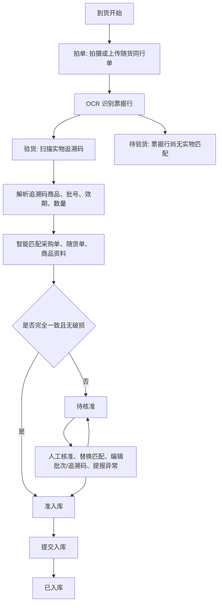
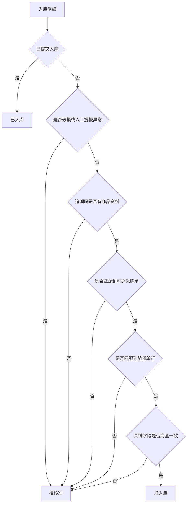

# 掌店易智能入库 PRD

## 0. 文档信息

| 项目 | 内容 |
| --- | --- |
| 功能名称 | 掌店易智能入库 |
| 文档版本 | v0.1 讨论稿 |
| 文档类型 | PRD-standard |
| 当前状态 | 讨论中，基于现有 demo、项目文档和交互 QA 反推成品规则 |
| 适用端 | 医药 O2O 前置仓店员工作台，高拍仪/扫码设备一体屏 |
| 核心页面 | 拍单、验货、核准 |
| 更新时间 | 2026-06-29 |
| 主要依据 | `demo说明.md`、`三步入库业务逻辑与交互说明.md`、`需求提示词.md`、`design-qa.md`、`app.js` |

### 0.1 文档状态说明

本稿用于产品验收和后续修正，优先沉淀成品级业务规则。以下内容分为三类：

| 标记 | 含义 |
| --- | --- |
| 已由 demo 验证 | 当前 demo 已经实现或通过 QA 验证的行为 |
| 成品建议 | demo 已表达方向，但生产实现需要进一步工程化的规则 |
| 待确认 | 需要业务、研发、运营或合规继续确认的决策点 |

## 1. 背景与目标

### 1.1 业务背景

医药 O2O 前置仓入库时，店员需要同时核对：

| 口径 | 含义 | 主要来源 |
| --- | --- | --- |
| 账 | 系统采购单 | 采购系统、ERP、WMS |
| 票 | 随货同行单 | 高拍仪拍摄图片、OCR 识别 |
| 码 | 药品追溯码 | 码上放心/追溯码平台 |
| 实 | 实物药品 | 扫码得到的商品、批号、效期、数量 |
| 商品资料 | 挂网/商品主数据 | 美团商品、药品基础资料、条码/准字信息 |

传统入库依赖店员手工找采购单、翻票、扫实物、录批次、人工判断差异，容易出现耗时长、漏核、错核、异常分散的问题。当前 demo 将流程压缩为三步：

1. 拍单：拍摄或上传随货同行单。
2. 验货：扫描实物追溯码。
3. 核准：系统自动匹配采购单、随货单、实物和商品资料，将正常商品直接放入准入库，将异常集中留给人工核准。

### 1.2 产品目标

| 目标 | 说明 |
| --- | --- |
| 降低找单成本 | 店员不需要先手动查找采购单，系统根据票据、追溯码和待收采购单自动匹配。 |
| 降低人工核对成本 | 正常一致的商品自动进入准入库，不弹确认，不要求逐条人工点过。 |
| 集中处理异常 | 数量、批号、名称、规格、准字、追溯码资料缺失、破损等异常统一在核准页处理。 |
| 保留可追溯证据 | 每条核准明细可回看实物追溯码、采购单、随货单命中行和商品资料。 |
| 支撑成品交付 | 将 demo 行为补齐为可开发、可测试、可验收的业务规则。 |

### 1.3 非目标

| 非目标 | 说明 |
| --- | --- |
| 不做独立找单步骤 | 成品仍坚持三步入库，不恢复“找单、拍单、验货、核准”的四步结构。 |
| 不做完整 ERP/WMS 重构 | 本功能只负责智能入库工作流，采购、结算、库存台账仍由既有系统承接。 |
| 不在主界面展示算法说明 | 店员界面只呈现需要操作的信息，不展示长篇业务解释或匹配原理说明。 |
| 不把异常自动闭环为采退 | 本稿只定义异常标记和提报入口，采退、供应商反馈、质控审批需另行对接。 |
| 不替代合规审核 | 药品效期、处方、资质等合规规则如果需要强校验，应接入独立合规模块。 |

## 2. 用户与场景

### 2.1 角色

| 角色 | 主要诉求 | 核心操作 |
| --- | --- | --- |
| 前置仓店员 | 快速完成到货入库，减少人工核对 | 拍单、验货、处理异常、提交入库 |
| 店长/运营 | 关注异常、破损、差异和入库效率 | 查看待核准、处理异常、复核数据 |
| 采购/供应链系统 | 提供采购单和采购状态 | 返回待收货采购单、接收入库结果 |
| OCR/追溯码/商品资料服务 | 提供结构化识别结果 | 识别票据行、解析追溯码、返回药品资料 |
| 测试/研发 | 需要明确状态、边界、验收规则 | 按本 PRD 设计接口、状态机和测试用例 |

### 2.2 核心场景

| 场景 | 输入 | 系统判断 | 输出 |
| --- | --- | --- | --- |
| 完全一致入库 | 票据、实物、采购单一致 | 无异常字段，无破损 | 自动进入准入库 |
| 数量异常 | 实物扫码数量与采购单或票据数量不同 | 数量字段异常 | 进入待核准 |
| 批号异常 | 追溯码批号与采购单/票据批号不同 | 批号字段异常 | 进入待核准 |
| 名称/规格异常 | 追溯码商品与采购单商品不一致 | 名称、规格、准字等字段异常 | 进入待核准 |
| 追溯码无商品资料 | 追溯码可扫，但平台无商品信息 | 无法完成商品身份匹配 | 进入待核准 |
| 破损商品 | 店员在验货页标记破损 | 破损优先级高于自动通过 | 进入待核准 |
| 未验货 | 已拍票据，但某些票据行未被扫码匹配 | 无实物扫描证据 | 进入待验货 |
| 提交入库 | 准入库清单存在商品 | 系统提交入库 | 移入已入库 |

## 3. 范围与术语

### 3.1 功能范围

| 模块 | 范围 |
| --- | --- |
| 拍单 | 高拍仪拍摄、相册上传、票据图片管理、OCR 任务触发、票据行结果留存 |
| 验货 | 追溯码扫描、批次聚合、扫码反馈、码列表管理、破损标记、待核准/无需核准提示 |
| 核准 | 智能匹配采购单和随货单、三方比对、异常队列、候选替换、批次/追溯码编辑、异常提报 |
| 状态卡 | 待验货、待核准、准入库、已入库四类清单统计和页内查看 |
| 入库提交 | 准入库商品提交入库，成功后进入已入库 |

### 3.2 状态命名

| 状态 | 推荐名称 | 说明 |
| --- | --- | --- |
| uninspected | 待验货 | 已拍单/OCR 有票据行，但尚未被追溯码实物匹配。早期文档曾写“未验货”，成品建议统一为“待验货”。 |
| pending | 待核准 | 系统发现异常，或需要人工明确处理的商品。 |
| ready | 准入库 | 系统自动判断一致，或人工核准通过，等待提交入库。 |
| inbound | 已入库 | 已提交入库成功的商品明细。 |

### 3.3 业务粒度

成品建议以“商品 + 批号 + 效期 + 追溯码集合”为最小核准单元，简称入库明细。

| 粒度 | 用途 |
| --- | --- |
| 追溯码 | 识别实物单支/单盒，做唯一性校验和数量来源。 |
| 批次组 | 验货页展示与核准页聚合的基本单位。 |
| 入库明细 | 与采购单行、随货单行进行三方比对和入库提交。 |
| 采购单 | 状态卡清单和提交入库时的汇总维度。 |
| 随货单图片 | 待验货清单和 OCR 证据维度。 |

## 4. 总体流程

### 4.1 主流程

### 4.2 页面流转

| 当前状态 | 可进入页面 | 规则 |
| --- | --- | --- |
| 无票据图片 | 拍单 | 点击验货或核准时提示“请先拍摄或上传随货同行单”。 |
| 已有票据图片 | 拍单、验货 | 可进入验货；系统异步处理 OCR。 |
| 已有扫码数据 | 拍单、验货、核准 | 进入核准时先展示智能匹配 loading，再展示核准工作台。 |
| 无待核准商品 | 核准 | 核准队列为空，但状态卡仍可查看准入库、已入库、待验货清单。 |
| 有准入库商品 | 核准状态卡 | 点击准入库可提交入库。 |

### 4.3 状态优先级

当同一明细命中多个状态规则时，按以下优先级决定最终状态：

1. 已入库：已成功提交入库的明细，优先展示为已入库。
2. 待核准：破损、人工提报异常、追溯码无商品资料、采购单/票据/实物关键字段不一致。
3. 准入库：账、票、实、码关键字段一致且无破损。
4. 待验货：有票据/OCR 行，但无实物追溯码匹配。

## 5. 数据模型

### 5.1 核心实体

| 实体 | 关键字段 | 说明 |
| --- | --- | --- |
| ReceiptPhoto | id、imageUrl、title、createdAt、ocrStatus | 随货同行单图片。 |
| ReceiptLine | id、photoId、lineNo、name、spec、approval、maker、qty、batch、productionDate、expiry、price、amount、cropImageUrl、confidence | OCR 识别出的票据行。 |
| TraceCode | code、status、productId、name、spec、approval、barcode、manufacturer、batch、productionDate、expiry、source、scannedAt | 单个追溯码解析结果。 |
| PhysicalBatch | id、identityKey、name、spec、approval、batch、expiry、codes、qty、damaged、unmatched | 验货页聚合出的实物批次组。 |
| PurchaseOrder | id、supplierId、supplierName、platformOrderId、status、createdAt、expectedAt、source、lines | 系统采购单。 |
| PurchaseLine | id、orderId、name、spec、approval、barcode、manufacturer、qty、batch、productionDate、expiry、price、amount | 采购单商品行。 |
| MeituanProduct | productId、saleName、name、spec、approval、barcode、manufacturer、rxType、price、imageUrls | 美团商品资料。 |
| ApprovalLine | id、physicalBatchId、purchaseLineId、receiptLineId、meituanProductId、abnormalFields、issue、decision、evidenceSnapshot | 核准明细。 |
| InboundSubmission | id、lineIds、status、submittedBy、submittedAt、result、errorMessage | 入库提交记录。 |

### 5.2 关键字段定义

| 字段 | 是否关键 | 说明 |
| --- | --- | --- |
| 商品名称 | 是 | 名称不一致时进入待核准。 |
| 规格 | 是 | 规格不一致时进入待核准。 |
| 国药准字 | 是 | 用于商品身份确认，缺失或冲突进入待核准。 |
| 条码 | 建议关键 | 有资料时参与比对；缺失不一定阻断，但需记录。 |
| 厂家 | 建议关键 | 与准字、商品资料共同判断身份。 |
| 批号 | 是 | 批号不一致进入待核准。 |
| 生产日期 | 可选关键 | 依业务规则启用，异常时建议进入待核准。 |
| 效期 | 是 | 效期缺失、过期、冲突进入待核准。 |
| 数量 | 是 | 追溯码数量是实物数量来源，与采购/票据不一致进入待核准。 |
| 供应商 | 建议关键 | 采购单匹配和风险提示使用。 |
| 金额 | 可选关键 | 用于票据和采购单核对，默认不阻断入库，除非业务要求。 |

## 6. 智能匹配与算法逻辑

### 6.1 算法输入

| 输入 | 来源 | 用途 |
| --- | --- | --- |
| 票据图片 | 拍单页 | OCR 识别票据行和局部命中图。 |
| 票据结构化行 | OCR 服务 | 与实物、采购单做匹配。 |
| 追溯码解析结果 | 追溯码平台 | 生成实物商品、批号、效期和数量。 |
| 待收采购单 | 采购系统 | 作为“账”的来源。 |
| 商品主数据 | 美团商品/药品资料 | 辅助确认名称、准字、厂家、条码和商品图。 |
| 店员标记 | 破损、编辑、替换匹配 | 修正算法结果和形成审计记录。 |

### 6.2 追溯码解析与实物聚合

1. 每个追溯码必须做唯一性校验。
2. 已扫过的追溯码不得重复计数，应定位并高亮已有批次。
3. 追溯码解析成功后，按商品身份和批次聚合为 PhysicalBatch。
4. 聚合主键建议为：`approval + barcode + batch + expiry`。
5. 当准字或条码缺失时，降级使用：`normalizedName + normalizedSpec + manufacturer + batch + expiry`。
6. 同一批次新增追溯码时，追加到原批次并将该批次置顶。
7. 新批次或新商品扫码时，创建新批次并置顶。
8. 一次扫描可以返回多个追溯码，当前批次和当前码应有即时反馈。
9. 删除最后一个追溯码时，删除对应批次，并清空该批次的展开、破损等临时状态。

### 6.3 采购单候选匹配

成品建议采用候选评分，不要求店员先找单。

| 维度 | 建议权重 | 说明 |
| --- | ---: | --- |
| 商品身份 | 30 | 准字、条码、名称、规格、厂家相似度。 |
| 批号/效期 | 20 | 批号完全匹配优先，效期辅助确认。 |
| 供应商 | 15 | 票据供应商、采购单供应商一致性。 |
| 数量 | 15 | 实物追溯码数量、票据数量、采购数量接近度。 |
| 票据证据 | 10 | OCR 行是否能与采购单行互相印证。 |
| 单据状态与时间 | 10 | 待收货、未入库、近期采购单优先。 |

| 分数 | 处理方式 |
| --- | --- |
| >= 85 | 可自动绑定采购单候选。若三方字段一致，进入准入库。 |
| 60-84 | 作为候选展示。若存在关键异常，进入待核准。 |
| < 60 | 不自动绑定。进入待核准，提示未找到可靠采购单候选。 |

以上阈值为成品建议，需结合真实数据回放调参。

### 6.4 随货单行候选匹配

随货单行匹配用于回答“票是否支持当前实物和采购单”。

| 维度 | 规则 |
| --- | --- |
| 商品身份 | 名称、规格、准字、厂家越一致分数越高。 |
| 批号/效期 | 与实物批号一致时优先。 |
| 数量 | 与实物数量或采购数量一致时加分。 |
| 图片位置 | 保留票据局部截图，供核准页放大查看。 |
| 多票据 | 所有已拍票据均参与候选排序。 |

当系统选错票据行时，店员可在核准页选择“随货单商品匹配错了，换一个”，从候选列表替换。

### 6.5 三方一致性判断

核准页以实物为基准，比较实物、采购单、随货单。

| 字段 | 通过条件 | 异常处理 |
| --- | --- | --- |
| 名称 | 归一化后相同，或通过准字/条码确认同一商品 | 加入 abnormalFields.name |
| 规格 | 标准规格相同 | 加入 abnormalFields.spec |
| 国药准字 | 完全一致 | 加入 abnormalFields.approval |
| 条码 | 有值时一致 | 加入 abnormalFields.barcode 或记录为资料缺失 |
| 厂家 | 有值时一致 | 加入 abnormalFields.manufacturer |
| 批号 | 完全一致 | 加入 abnormalFields.batch |
| 效期 | 日期一致或在业务容差内 | 加入 abnormalFields.expiry |
| 数量 | 追溯码数量与采购/票据数量一致 | 加入 abnormalFields.qty |
| 供应商 | 采购单和票据供应商一致 | 加入 abnormalFields.supplier |
| 金额 | 采购单和票据金额一致 | 默认提示，不默认阻断，待业务确认 |

### 6.6 状态判定算法

### 6.7 自动通过规则

商品进入准入库必须同时满足：

1. 追溯码解析成功，且有可用商品身份资料。
2. 实物数量来自追溯码去重后的数量。
3. 有可靠采购单候选，且候选采购单状态允许收货。
4. 有随货单 OCR 命中行，或业务允许无票据行时先核准。
5. 商品名称、规格、准字、批号、效期、数量等关键字段一致。
6. 未被标记破损。
7. 未被人工提报异常。

### 6.8 重新计算规则

以下操作必须触发状态重算：

| 操作 | 重算范围 |
| --- | --- |
| 新增/删除票据图片 | 相关 OCR 行、待验货清单、随货单候选 |
| 新增/删除追溯码 | 对应实物批次、数量、状态卡 |
| 删除批次最后一个码 | 删除批次，恢复相关票据行为待验货 |
| 标记/取消破损 | 对应批次从准入库和待核准之间重算 |
| 替换采购单候选 | 对应核准明细的三方比对和状态 |
| 替换随货单候选 | 对应核准明细的三方比对和状态 |
| 编辑批次 | 对应核准明细的批号异常和最终入库批次 |
| 编辑追溯码 | 对应实物数量、追溯码证据和状态 |
| 提交入库成功 | 准入库转已入库 |

## 7. 页面与交互需求

### 7.1 全局布局

| 要求 | 说明 |
| --- | --- |
| 三个主 tab | 拍单、验货、核准。不得增加独立找单页。 |
| 工作台优先 | 摄像画面、扫码批次、核准详情是主内容，应占据最大可视面积。 |
| 状态卡贴底 | 待验货、待核准、准入库、已入库四个状态卡在底部紧凑展示，宽度和主内容视觉对齐。 |
| 状态卡可点击 | 点击状态卡打开页内清单，不使用遮挡主工作区的大弹窗。 |
| 少解释文案 | 页面不展示长篇流程说明、算法解释或营销文案。 |
| 一致动效 | 新增扫码、核准投放、状态数增加应有轻量反馈，但不能阻碍操作。 |

底部状态卡顺序按当前 demo 和 QA 结果统一为：

1. 待验货
2. 待核准
3. 准入库
4. 已入库

### 7.2 拍单页

#### 7.2.1 页面内容

| 区域 | 内容 |
| --- | --- |
| 高拍仪画面 | 随货同行单实时画面或上传后的票据图。 |
| 拍摄按钮 | 位于画面下方或画面内，触发拍照。 |
| 相册上传 | 作为次要操作贴近画面，不能单独占据大面积。 |
| 票据照片区 | 展示已拍/已上传票据缩略图、数量、删除入口。 |
| 清空入口 | 删除所有票据图片。 |
| 底部状态卡 | 展示四类状态数量。 |

#### 7.2.2 交互规则

| 操作 | 系统行为 |
| --- | --- |
| 点击拍摄 | 生成一张票据图片，加入照片区，触发 OCR，提示拍摄成功。 |
| 上传图片 | 校验格式和大小，加入照片区，触发 OCR，提示上传成功。 |
| 删除单张图片 | 删除图片及其 OCR 结果，重算待验货和核准结果。 |
| 清空图片 | 删除全部票据和 OCR 结果，清空扫码之后依赖票据的匹配状态，需二次确认。 |
| 点击验货 tab | 如果已有票据，进入验货；否则提示先拍摄或上传随货同行单。 |
| 点击核准 tab | 如果无票据，提示先拍单；如果有票据但无扫码，允许进入但主要展示待验货清单。 |

#### 7.2.3 OCR 规则

| 状态 | 处理 |
| --- | --- |
| OCR 成功 | 保存结构化票据行、行号、局部截图、置信度。 |
| OCR 部分成功 | 成功行正常参与匹配，低置信度行标记为待确认。 |
| OCR 失败 | 保留图片，标记 OCR 失败，允许重试或手工补录，相关商品不得自动准入库。 |
| 多张票据 | 每张票据独立识别，核准时可跨票据选择候选行。 |

### 7.3 验货页

#### 7.3.1 页面内容

| 区域 | 内容 |
| --- | --- |
| 扫码画面 | 扫描追溯码，展示当前识别码。 |
| 模拟/扫码按钮 | demo 为模拟识别，成品接入硬件扫码或相机识别。 |
| 扫码统计 | 展示已扫批次数、追溯码数。 |
| 批次列表 | 按最近扫码置顶，展示商品、规格、准字、批号、效期、追溯码、状态。 |
| 搜索 | 按商品名、规格、准字、批号、效期、追溯码搜索。 |
| 追溯码管理 | 每个批次可查看全部追溯码并删除。 |
| 破损标记 | 每个批次可标记破损。 |
| 底部状态卡 | 实时更新待验货、待核准、准入库、已入库。 |

#### 7.3.2 扫码规则

| 场景 | 系统行为 |
| --- | --- |
| 单次扫到一个码 | 解析后加入对应批次，批次置顶。 |
| 单次扫到多个码 | 全部解析并展示当前码集合，以顿号分隔。 |
| 同批次新增码 | 追加到原批次，更新数量并置顶。 |
| 新商品/新批次 | 创建新批次行，置顶并高亮。 |
| 重复码 | 不重复计数，提示已扫描，并高亮原批次。 |
| 无效码 | 不入库，不计数，提示追溯码无效。 |
| 追溯平台无商品资料 | 创建“没有找到商品信息”批次，进入待核准。 |
| 解析服务异常 | 保留原始码，标记待核准，允许后续重试。 |

#### 7.3.3 批次状态

| 状态 | 条件 | 展示 |
| --- | --- | --- |
| 无需核准 | 已匹配采购单和票据，关键字段一致，未破损 | 绿色或成功状态 |
| 待核准 | 存在异常、破损、无商品资料、匹配不确定 | 橙色或警示状态 |

验货页只做轻量状态提示，不展开复杂三方比对。复杂解释统一放到核准页。

#### 7.3.4 追溯码删除

| 操作 | 系统行为 |
| --- | --- |
| 删除单个追溯码 | 从批次 codes 中移除，重算数量和状态。 |
| 删除最后一个码 | 删除整个批次，清除该批次破损状态和展开状态。 |
| 删除后影响票据行 | 若票据行不再有实物匹配，应回到待验货。 |
| 删除已入库码 | 成品应禁止删除，或走冲销/撤回流程，待业务确认。 |

### 7.4 核准页

#### 7.4.1 页面结构

| 区域 | 内容 |
| --- | --- |
| 智能匹配 loading | 进入核准页后短暂展示“正在智能匹配系统单据”。 |
| 待核准队列 | 展示待处理商品，支持搜索和切换当前明细。 |
| 当前核准详情 | 展示入库信息、随货单命中、三方比对、美团商品资料。 |
| 操作入口 | 核准完毕、核准待定、换采购单、换随货单、编辑追溯码、编辑批次、提报异常。 |
| 状态卡详情页 | 点击底部状态卡后进入页内清单。 |

#### 7.4.2 队列规则

| 规则 | 说明 |
| --- | --- |
| 默认选中 | 默认选中第一条待核准明细。 |
| 搜索 | 支持按商品名、规格、准字、批号、效期、追溯码搜索。 |
| 核准后切换 | 当前明细被放入准入库或确认待核准后，自动切到下一条。 |
| 队列为空 | 展示空状态，仍保留状态卡入口。 |
| 已确认待核准 | 可从当前队列移除，但仍保留在待核准状态卡清单中。 |

#### 7.4.3 入库信息卡

| 字段 | 说明 |
| --- | --- |
| 采购单号 | 当前匹配采购单。 |
| 供应商 | 当前匹配采购单/票据供应商。 |
| 平台订单号 | 如有则展示。 |
| 采购状态 | 待收货、未入库等。 |
| 商品名称/规格 | 当前入库明细商品。 |
| 数量 | 实物追溯码数量。 |
| 批号/效期 | 默认取实物批号和效期，可编辑入库批次。 |
| 追溯码 | 展示数量，可进入编辑/查看。 |
| 随货单命中 | 展示局部截图，不展示整张票据占位。 |

#### 7.4.4 三方比对

| 展示规则 | 说明 |
| --- | --- |
| 以实物为基准 | 比较实物、采购单、随货单。 |
| 异常字段优先 | 异常字段默认展开并置顶。 |
| 正常字段折叠 | 正常字段默认折叠，提供展开全部字段入口。 |
| 无异常时 | 只展示简洁一致结果和展开入口，不堆满表格。 |
| 不放商品图 | 比对表只放字段，不把图片塞入单元格。 |

比对字段建议包含：

| 字段 |
| --- |
| 商品名称 |
| 规格 |
| 国药准字 |
| 条码 |
| 厂家 |
| 处方属性 |
| 批号 |
| 生产日期 |
| 效期 |
| 数量 |
| 供应商 |
| 金额 |

#### 7.4.5 候选替换

| 操作 | 触发入口 | 系统行为 |
| --- | --- | --- |
| 换采购单商品 | “采购单商品匹配错了，换一个” | 打开候选列表，展示采购单号、供应商、商品、规格、数量、匹配分。选择后重算比对。 |
| 换随货单商品 | “随货单商品匹配错了，换一个” | 打开候选列表，展示票据来源、局部图、商品、规格、批号、匹配分。选择后重算比对。 |
| 查看随货单命中 | 点击局部截图 | 放大查看命中行。 |

#### 7.4.6 编辑与提报

| 操作 | 系统行为 |
| --- | --- |
| 编辑追溯码 | 打开追溯码列表，允许修改或删除，保存后重算数量和状态。 |
| 编辑批次 | 可一键选择实物批次、随货单批次、原始采购单批次，或手工输入。保存后重算比对。 |
| 提报异常 | 标记当前明细异常，保留在待核准，并生成异常记录。 |
| 核准完毕 | 当前明细进入准入库，自动切到下一条。 |
| 核准待定 | 当前明细保留在待核准，但从当前处理队列移出，自动切到下一条。 |

### 7.5 状态卡清单

#### 7.5.1 待验货清单

| 内容 | 说明 |
| --- | --- |
| 汇总维度 | 按随货单图片汇总。 |
| 展示内容 | 票据缩略图、供应商、未验货行数、OCR 行明细。 |
| OCR 行字段 | 行号、商品名、规格、厂家、数量、批次、单价、金额。 |
| 交互 | 可展开/收起票据行。 |

#### 7.5.2 待核准清单

| 内容 | 说明 |
| --- | --- |
| 汇总维度 | 按采购单汇总。 |
| 展示内容 | 商品、规格、准字、批号、效期、数量、异常原因。 |
| 交互 | 点击查看核对详情，进入同一套核准证据快照。 |

#### 7.5.3 准入库清单

| 内容 | 说明 |
| --- | --- |
| 汇总维度 | 按采购单汇总。 |
| 展示内容 | 商品、规格、准字、批号、效期、数量、一致性说明。 |
| 核心操作 | 提交入库。 |
| 提交成功 | 明细从准入库移入已入库，准入库数量减少，已入库数量增加。 |
| 空状态 | 无可提交明细时，提交按钮禁用。 |

#### 7.5.4 已入库清单

| 内容 | 说明 |
| --- | --- |
| 汇总维度 | 按采购单汇总。 |
| 展示内容 | 已提交商品、批号、效期、数量、提交时间、操作人。 |
| 交互 | 可查看核对详情快照，不允许直接编辑。 |

## 8. 业务规则与边界场景

### 8.1 入口与流程边界

| 编号 | 场景 | 规则 |
| --- | --- | --- |
| BR-001 | 未拍单进入验货 | 拦截，提示先拍摄或上传随货同行单。 |
| BR-002 | 未拍单进入核准 | 拦截，提示先拍摄或上传随货同行单。 |
| BR-003 | 已拍单但未验货进入核准 | 允许进入，展示待验货状态和空核准队列。 |
| BR-004 | 返回上一步 | 已拍照片、扫码数据、核准决策不丢失。 |
| BR-005 | 刷新页面 | 成品应从后端恢复当前入库会话，demo 可不要求。 |

### 8.2 拍单边界

| 编号 | 场景 | 规则 |
| --- | --- | --- |
| BR-101 | 图片格式不支持 | 阻止上传，提示支持格式。 |
| BR-102 | 图片过大 | 压缩或阻止上传，提示重新上传。 |
| BR-103 | 重复上传同一图片 | 可允许，但需提示可能重复；成品建议做图片 hash 去重。 |
| BR-104 | OCR 失败 | 保留图片，标记 OCR 失败，允许重试或手工补录。 |
| BR-105 | OCR 行置信度低 | 参与候选但不得自动准入库。 |
| BR-106 | 多张票据同一商品 | 候选匹配时按分数排序，避免重复计入数量。 |
| BR-107 | 删除票据后已有核准结果 | 必须提示影响核准结果；确认后删除并重算。 |

### 8.3 验货边界

| 编号 | 场景 | 规则 |
| --- | --- | --- |
| BR-201 | 重复扫码 | 不重复计数，提示已扫描并高亮原批次。 |
| BR-202 | 追溯码格式错误 | 不计数，提示无效码。 |
| BR-203 | 追溯码平台超时 | 记录原始码，进入待核准，允许稍后重试。 |
| BR-204 | 无商品资料 | 建立待核准行，名称展示“没有找到商品信息”。 |
| BR-205 | 同商品不同批号 | 拆成不同批次行。 |
| BR-206 | 同批次多码 | 聚合为一个批次，数量为去重码数。 |
| BR-207 | 删除最后一个码 | 删除批次，并重算待验货。 |
| BR-208 | 标记破损 | 对应批次强制进入待核准。 |
| BR-209 | 取消破损 | 重新按一致性规则判定准入库或待核准。 |
| BR-210 | 已入库商品再扫码 | 成品应提示已入库或重复入库风险，不自动计入。 |

### 8.4 匹配边界

| 编号 | 场景 | 规则 |
| --- | --- | --- |
| BR-301 | 找到多个采购单候选 | 默认选择最高分候选，低于自动阈值时进入待核准。 |
| BR-302 | 未找到采购单候选 | 进入待核准，允许人工选择或提报异常。 |
| BR-303 | 采购单状态不允许入库 | 进入待核准，不自动准入库。 |
| BR-304 | 供应商不一致 | 进入待核准或提示风险，待业务确认是否阻断。 |
| BR-305 | 数量不一致 | 进入待核准，异常字段为数量。 |
| BR-306 | 批号不一致 | 进入待核准，异常字段为批号。 |
| BR-307 | 名称/规格不一致 | 进入待核准，异常字段为名称或规格。 |
| BR-308 | 准字不一致 | 进入待核准，异常字段为国药准字。 |
| BR-309 | 效期过期 | 成品建议进入待核准并标记高风险，是否禁止入库待确认。 |
| BR-310 | 近效期 | 成品建议进入待核准或提示风险，阈值待业务确认。 |

### 8.5 核准边界

| 编号 | 场景 | 规则 |
| --- | --- | --- |
| BR-401 | 核准队列为空 | 展示空状态，不影响状态卡查看。 |
| BR-402 | 核准完毕 | 明细进入准入库，自动切到下一条。 |
| BR-403 | 核准待定 | 明细保留待核准，从当前队列移除，自动切到下一条。 |
| BR-404 | 替换采购单候选 | 重算异常字段和推荐状态。 |
| BR-405 | 替换随货单候选 | 重算异常字段和推荐状态。 |
| BR-406 | 编辑批次 | 保存后记录操作人和变更前后值，重算比对。 |
| BR-407 | 编辑追溯码 | 保存后记录操作人和变更前后值，重算数量。 |
| BR-408 | 提报异常 | 明细保留待核准，并生成异常单据或异常记录。 |
| BR-409 | 已入库后查看详情 | 只读展示核准快照，不允许修改。 |

### 8.6 提交入库边界

| 编号 | 场景 | 规则 |
| --- | --- | --- |
| BR-501 | 准入库为空 | 提交按钮禁用或提示暂无可提交明细。 |
| BR-502 | 部分提交成功 | 成功明细进入已入库，失败明细留在准入库并展示失败原因。 |
| BR-503 | 提交接口超时 | 不改变本地最终状态，展示重试入口。 |
| BR-504 | 重复点击提交 | 使用提交幂等键，避免重复入库。 |
| BR-505 | 库存系统返回失败 | 保留准入库，展示错误并记录日志。 |

## 9. 权限、审计与合规

### 9.1 权限建议

| 操作 | 店员 | 店长/主管 | 系统 |
| --- | --- | --- | --- |
| 拍单/上传 | 允许 | 允许 | 不适用 |
| 扫码验货 | 允许 | 允许 | 不适用 |
| 标记破损 | 允许 | 允许 | 不适用 |
| 核准完毕 | 允许，是否需要主管权限待确认 | 允许 | 自动一致时允许系统推荐 |
| 核准待定 | 允许 | 允许 | 不适用 |
| 替换采购单/随货单候选 | 建议允许但记录审计 | 允许 | 不适用 |
| 编辑批次/追溯码 | 建议需权限或二次确认 | 允许 | 不适用 |
| 提交入库 | 允许，是否按门店权限控制待确认 | 允许 | 不适用 |

### 9.2 审计记录

以下行为必须记录：

| 行为 | 记录内容 |
| --- | --- |
| 拍摄/上传/删除票据 | 图片 id、操作人、时间、OCR 状态。 |
| 扫码/删除追溯码 | 追溯码、批次、操作人、时间、结果。 |
| 标记破损 | 批次、变更前后值、操作人、时间。 |
| 替换采购单/随货单候选 | 原候选、新候选、分数、操作人、时间。 |
| 编辑批次/追溯码 | 变更前、变更后、原因、操作人、时间。 |
| 核准完毕/核准待定 | 明细 id、决策、操作人、时间。 |
| 提报异常 | 异常类型、说明、证据、操作人、时间。 |
| 提交入库 | 提交明细、接口结果、幂等键、操作人、时间。 |

## 10. 接口与系统依赖

### 10.1 依赖服务

| 服务 | 能力 | 失败时策略 |
| --- | --- | --- |
| OCR 服务 | 识别随货同行单，返回结构化行和局部截图 | 标记 OCR 失败，允许重试或手工补录。 |
| 追溯码服务 | 解析追溯码商品、批号、效期、唯一性 | 原始码进入待核准，允许重试。 |
| 采购单服务 | 查询待收货/未入库采购单和商品行 | 无候选时进入待核准。 |
| 商品资料服务 | 返回美团商品、药品准字、条码、厂家、图片 | 缺失时不一定阻断，但降低自动通过置信度。 |
| 匹配引擎 | 输出采购单候选、票据候选、异常字段和推荐状态 | 失败时所有相关明细进入待核准。 |
| 入库服务 | 提交准入库明细并写入库存 | 失败明细留在准入库。 |
| 审计日志服务 | 记录关键操作 | 失败时应阻断高风险编辑或本地补偿，待研发确认。 |

### 10.2 入库会话建议

成品建议每次到货处理建立一个 InboundSession：

| 字段 | 说明 |
| --- | --- |
| sessionId | 入库会话 id。 |
| storeId | 门店/仓 id。 |
| operatorId | 操作人。 |
| status | draft、matching、approving、submitted、closed。 |
| receiptPhotoIds | 票据图片集合。 |
| physicalBatchIds | 实物批次集合。 |
| approvalLineIds | 核准明细集合。 |
| createdAt/updatedAt | 创建和更新时间。 |

### 10.3 幂等规则

| 操作 | 幂等键 |
| --- | --- |
| 票据上传 | sessionId + imageHash |
| 追溯码入会话 | sessionId + traceCode |
| 核准决策 | sessionId + approvalLineId + decisionVersion |
| 提交入库 | sessionId + sortedApprovalLineIds + submitVersion |

## 11. 埋点与指标

### 11.1 关键埋点

| 事件 | 触发时机 | 关键属性 |
| --- | --- | --- |
| receipt_photo_added | 拍摄或上传票据成功 | sessionId、source、photoCount |
| receipt_ocr_completed | OCR 完成 | sessionId、lineCount、failedLineCount、duration |
| receipt_ocr_failed | OCR 失败 | sessionId、errorCode |
| trace_scan_success | 追溯码识别成功 | sessionId、codeCount、batchId |
| trace_scan_duplicate | 重复扫码 | sessionId、traceCode、batchId |
| trace_scan_failed | 追溯码识别失败 | sessionId、errorCode |
| batch_damaged_changed | 破损标记变更 | sessionId、batchId、damaged |
| approval_matching_started | 进入核准页 | sessionId |
| approval_matching_completed | 智能匹配完成 | sessionId、pendingCount、readyCount、uninspectedCount、duration |
| approval_decision_made | 人工核准决策 | sessionId、lineId、decision、issueType |
| match_candidate_replaced | 替换候选 | sessionId、lineId、type、oldId、newId |
| inbound_submit_clicked | 点击提交入库 | sessionId、lineCount |
| inbound_submit_completed | 入库提交完成 | sessionId、successCount、failCount、duration |

### 11.2 业务指标

| 指标 | 说明 |
| --- | --- |
| 自动准入库率 | 自动进入准入库明细数 / 已验货明细数。 |
| 人工核准率 | 待核准明细数 / 已验货明细数。 |
| OCR 成功率 | OCR 成功票据数 / 拍摄票据数。 |
| 追溯码解析成功率 | 成功解析追溯码数 / 扫码总数。 |
| 平均入库耗时 | 从第一张票据到提交入库成功的耗时。 |
| 异常类型分布 | 数量、批号、名称、规格、无商品资料、破损等占比。 |
| 候选替换率 | 人工替换采购单/票据候选次数 / 待核准明细数。 |

## 12. 验收标准

### 12.1 全局验收

| 编号 | Given | When | Then |
| --- | --- | --- | --- |
| AC-001 | 用户首次进入 demo | 页面加载完成 | 首屏为拍单工作台，不出现营销落地页。 |
| AC-002 | 无票据图片 | 点击验货或核准 | 系统提示先拍摄或上传随货同行单。 |
| AC-003 | 已有票据图片 | 点击验货 | 成功进入验货页。 |
| AC-004 | 状态发生变化 | 查看底部状态卡 | 待验货、待核准、准入库、已入库数量实时更新。 |
| AC-005 | 点击任一状态卡 | 状态卡有明细 | 打开页内清单，而不是遮挡式大弹窗。 |

### 12.2 拍单验收

| 编号 | Given | When | Then |
| --- | --- | --- | --- |
| AC-101 | 在拍单页 | 点击拍摄 | 照片加入列表，已拍票据数增加。 |
| AC-102 | 在拍单页 | 上传有效图片 | 图片加入列表并触发 OCR。 |
| AC-103 | 已有多张票据 | 删除其中一张 | 对应 OCR 行和状态数量被重算。 |
| AC-104 | 已有票据 | 点击清空 | 所有票据被删除，依赖票据的待验货和核准数据被重算。 |
| AC-105 | OCR 成功 | 进入待验货清单 | 能看到按票据图片汇总的 OCR 行。 |

### 12.3 验货验收

| 编号 | Given | When | Then |
| --- | --- | --- | --- |
| AC-201 | 已拍单 | 扫描一个正常追溯码 | 生成批次行，状态为无需核准或待核准。 |
| AC-202 | 已有同批次行 | 再扫同批次新码 | 码追加到原批次，批次置顶，数量增加。 |
| AC-203 | 扫到重复码 | 系统识别重复 | 不重复计数，并高亮已有批次。 |
| AC-204 | 扫到无商品资料码 | 解析完成 | 生成“没有找到商品信息”待核准行。 |
| AC-205 | 标记某批次破损 | 开关打开 | 该批次进入待核准，准入库数量减少或不增加。 |
| AC-206 | 删除批次最后一个码 | 删除成功 | 批次行消失，待验货数量按票据行重算。 |
| AC-207 | 搜索商品/批号/追溯码 | 输入关键词 | 批次列表只展示匹配项。 |

### 12.4 核准验收

| 编号 | Given | When | Then |
| --- | --- | --- | --- |
| AC-301 | 已有扫码数据 | 进入核准页 | 先展示智能匹配 loading，再展示核准工作台。 |
| AC-302 | 存在待核准明细 | 查看队列 | 队列展示待处理商品，默认选中第一条。 |
| AC-303 | 当前明细数量异常 | 查看比对表 | 数量异常字段默认展开并置顶。 |
| AC-304 | 当前明细批号异常 | 查看比对表 | 批号异常字段默认展开并置顶。 |
| AC-305 | 点击展开全部字段 | 正常字段折叠中 | 展开完整字段比对。 |
| AC-306 | 点击换采购单 | 选择候选 | 当前明细采购单被替换，比对结果重算。 |
| AC-307 | 点击换随货单 | 选择候选 | 当前明细随货单命中行被替换，比对结果重算。 |
| AC-308 | 点击核准完毕 | 当前明细待核准 | 明细进入准入库，队列自动切到下一条。 |
| AC-309 | 点击核准待定 | 当前明细待核准 | 明细留在待核准清单，队列自动切到下一条。 |
| AC-310 | 点击提报异常 | 当前明细存在问题 | 明细被标记异常并保留审计记录。 |

### 12.5 状态清单与提交验收

| 编号 | Given | When | Then |
| --- | --- | --- | --- |
| AC-401 | 有待验货明细 | 点击待验货状态卡 | 展示按票据图片汇总的 OCR 行。 |
| AC-402 | 有待核准明细 | 点击待核准状态卡 | 展示按采购单汇总的异常明细。 |
| AC-403 | 有准入库明细 | 点击准入库状态卡 | 展示准入库清单和提交入库按钮。 |
| AC-404 | 点击提交入库 | 入库接口成功 | 明细从准入库移到已入库，数量同步变化。 |
| AC-405 | 准入库为空 | 查看准入库清单 | 提交按钮禁用或展示暂无可提交。 |
| AC-406 | 已入库明细 | 点击查看详情 | 展示只读核对快照。 |

### 12.6 UI 验收

| 编号 | 标准 |
| --- | --- |
| AC-501 | 拍单页高拍仪画面是最大视觉主体，上传、清空等次要操作不抢占主空间。 |
| AC-502 | 验货页扫码画面和批次列表优先可见，批次行不被底部状态卡遮挡。 |
| AC-503 | 核准页队列、当前详情、状态卡三者对齐，不能出现外框套内框、底部空白或宽度不一致。 |
| AC-504 | 状态卡四等分紧凑展示，数量变化有反馈但不影响点击。 |
| AC-505 | 长商品名、长规格、长追溯码在移动和桌面视口均不溢出。 |
| AC-506 | 不出现长篇功能说明、流程解释、AI 式装饰卡片。 |

## 13. 示例数据与 demo 对照

| 示例 | demo 表现 | 成品规则 |
| --- | --- | --- |
| 阿莫西林胶囊 | 扫码后无需核准，核准页进入准入库 | 三方一致且无破损，自动准入库。 |
| 连花清瘟颗粒 | 扫码后无需核准，核准页进入准入库 | 三方一致且无破损，自动准入库。 |
| 布洛芬缓释胶囊 | 实物/票据数量 6，系统数量 8 | 数量异常，进入待核准。 |
| 盐酸左西替利嗪片 | 实物批号 Z250210，系统批号 Z250201 | 批号异常，进入待核准。 |
| 维生素 C 咀嚼片 | 实物名称与系统名称不一致 | 名称异常，进入待核准。 |
| 无商品资料追溯码 | 展示没有找到商品信息 | 追溯码资料缺失，进入待核准。 |
| 破损批次 | 开启破损后进入待核准 | 破损优先级高于自动通过。 |

## 14. 待确认问题

| 编号 | 问题 | 影响 |
| --- | --- | --- |
| Q-001 | 状态命名是否最终统一为“待验货”，不再使用“未验货”？ | UI 文案、测试用例、接口枚举。 |
| Q-002 | 采购单自动匹配阈值是否采用 85/60 分段？ | 自动准入库率和人工核准量。 |
| Q-003 | 供应商不一致是否必须阻断自动入库？ | 待核准规则。 |
| Q-004 | 金额差异是否阻断自动入库，还是仅提示？ | 三方比对字段优先级。 |
| Q-005 | 近效期/过期药品如何处理？ | 合规和异常规则。 |
| Q-006 | 编辑批次、编辑追溯码是否需要主管权限？ | 权限与审计。 |
| Q-007 | OCR 失败时是否允许手工补录票据行？ | 拍单页后续功能范围。 |
| Q-008 | 无可靠采购单候选时是否允许手工创建入库明细？ | 异常闭环和采购系统边界。 |
| Q-009 | 破损商品后续是否直接进入采退流程？ | 异常提报后续系统对接。 |
| Q-010 | 提交入库是按采购单批量提交，还是允许逐行提交？ | 准入库清单和接口设计。 |
| Q-011 | 已入库后是否支持撤回/冲销？ | 已入库清单和库存一致性。 |
| Q-012 | 票据图片、OCR 结果、追溯码和核准快照保存周期多久？ | 合规存证和存储成本。 |

## 15. PRD 自检结论

### 15.1 从产品视角

本稿已经覆盖核心目标、三步流程、状态定义、页面交互、智能匹配逻辑、异常边界和验收标准。当前最需要产品确认的是状态命名、自动匹配阈值、近效期规则、金额/供应商差异是否阻断、编辑权限和异常后续闭环。

### 15.2 从研发视角

可以基于本稿拆分为：入库会话、票据 OCR、追溯码解析、智能匹配、核准状态机、状态卡清单、入库提交、审计日志等模块。但在进入正式开发前，需要补齐真实接口字段、错误码、幂等策略、权限模型和数据持久化方案。

### 15.3 从测试视角

测试可以围绕四个状态、三类数据源、候选替换、编辑重算、重复扫码、无商品资料、破损、提交入库失败等场景设计用例。当前验收标准已覆盖 demo 主路径，但生产验收还需补充接口异常、并发操作、刷新恢复、权限拦截和审计日志校验。

### 15.4 交付准备度

| 维度 | 结论 |
| --- | --- |
| Demo 复现 | 已可对照现有 demo 验收。 |
| 业务规则 | 已形成完整讨论稿。 |
| 可开发性 | 基本可拆任务，但接口和权限仍待确认。 |
| 可测试性 | 主路径和关键边界可测试，生产异常用例需补充。 |
| 当前建议 | 进入产品评审，先关闭第 14 节待确认问题，再转开发 handoff。 |

